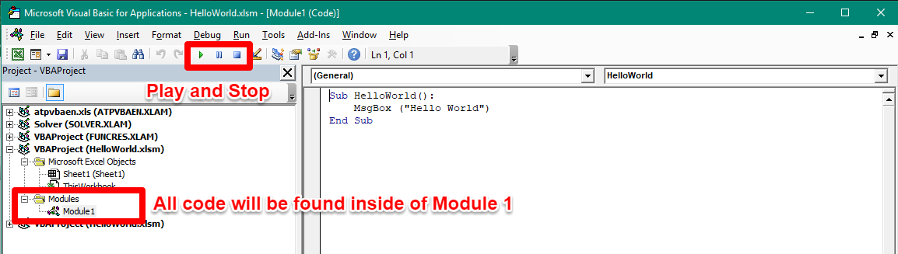
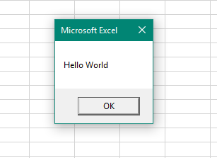
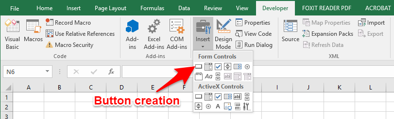
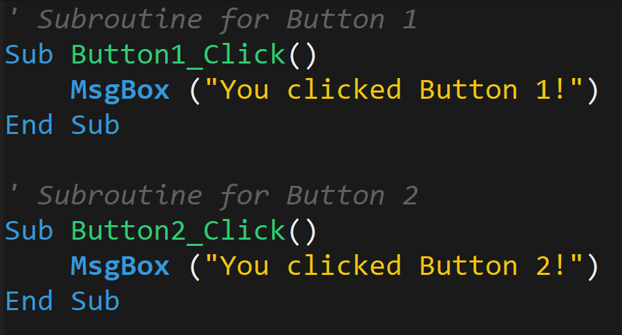
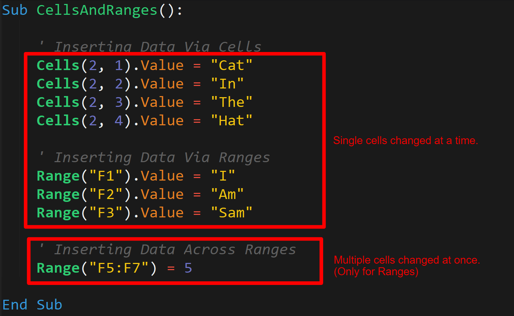

## 2.1 Lesson Plan - Very VBA
---

### Overview

In today's class, you will get your first exposure to fundamental programming in the form of VBA. Today's class will cover basic concepts like variables, arrays, and conditionals -- and serve as the prelude to your future work in Python and JavaScript.

### Class Objectives

* Understand the fundamental building blocks of all programming languages: variables, arrays, conditionals, loops, and functions
* Understand how to create simple VBA macros to trigger pop ups and change cell values
* Gain practice in writing VBA subroutines that utilize variables and conditionals
* Begin to develop your essential coding skills of syntax recollection, pattern recognition, problem decomposition, and debugging 

### Notes

* Today's class marks your first foray into fundamental programming. It is critical to know that what makes this week valuable isn't the VBA syntax, but rather the fundamental concepts you'll be learning that apply across all programming languages. 

* VBA syntax is fairly easy to pickup and the language is extremely similar to most fundamental programming languages. If anything, VBA is a simple first language to learn, as it combines basic programming tools with a GUI interface and familiar spreadsheet manipulation methods. By the end of the week, you will likely be surprised by how fun writing VBA code truly is.

----

### Activity 01: Hello World  

* Open your VBA Editor and navigate to Module 1. (All examples in our class can be found in Module 1).

* Overall interface:
  
  * That modules represent the applications VBA will be running. These can be created by right clicking on a sheet and then selecting "Insert Module". 

  * Once inside a module, we can begin to write out VBA script. In our case, we've pre-created a script that will trigger Excel to deliver a pop-up message.

  * Then hit Play inside your VBA editor to trigger this message.

  

  

  * The code begins with the keyword `Sub`, which is short for subroutine. This line is followed by `HelloWorld()`, which marks the title of our subroutine. The empty brackets indicate that our subroutine takes in no arguments. (Later we'll be talking about functions, which do take in arguments at a later point). 

  * Our subroutine has a single aim -- to create a pop-up message box (`MsgBox`) with the phrase "Hello World".

  * Once our subroutine has triggered its pop-up message, it's work is done and the subroutine completes. This completion is denoted by the `End Sub` keywords. Each subroutine must begin with the keyword `Sub` and end with the words `End Sub`.

  

### Activity 02: Hello VBA  

* You are now tasked with reproducing this effect on your own machines.

  * **Instructions**
    
    * Create and execute a VBA script that generates three pop-up messages with text contained therein.

### Activity 03: Button Clicks  

* Return to the Developer tab to see how to add a button to spreadsheet. 

* Once the button is created, you will be asked to "Assign a Macro to the button. You can choose to create a new macro or select a pre-existing one. If you accidentally close this window, you can always return to it by right-clicking your button and selecting "Assign Macro". If you are using the Excel file provided in [03-Ins_ButtonClicks](Activities/03-Ins_ButtonClicks), you will see that the button is associated with a macro that simply prints: "You clicked me" when pressed. 

  
  
  

----

### Activity 04: Choose Your Button 

* Open the Excel file in [04-Stu_ChooseYourButton](Activities/04-ChooseYourButton) and run the macro. You will be running a sub-routine of your own to trigger two buttons that elicit different messages when clicked. 

  * **Instructions**
    
    * Create an Excel file with two interactive buttons. These buttons should each be associated with a different VBA subroutine. When clicked, each button should trigger a different pop-up message. 

  

### Activity 05: Cells And Ranges

* Open the files found in [05-Ins_CellsAndRanges](Activities/05-Ins_CellsAndRanges) and run the macro. As you run the macro, you will notice: 

  * VBA provides two primary ways to modify the contents of spreadsheet: `Cells` and `Ranges`. 

  * `Cells` provide a numeric coordinate-based method for specifying cells of a spreadsheet. `Ranges` provide a more customary excel-based method for specifying cells of a spreadsheet. Please be noted that `Cells` are organized in a `(Row, Column)` format. 

  * `.Value` is a property we add to the end of our `Cell` / `Range` references to specify that we want to change the content value of these cells. This is worth noting that `Cells(X, X)` isn't just capturing the contents of the cell, but rather the entire "Cell Object" -- and with it, the formatting, style, and other aspects of the cell beyond the contents itself.

  * Cells only allow a developer to capture a single cell at a time, while Ranges allow us to capture multiple cells at once. For this reason Ranges are more often used; however, Cells have their use especially in "loop-based" programs because we can iteratively change the integer value of a cell. 

  

### Activity 06: Chess Board 

* In this activity, we'll be populating a chessboard with chess pieces using a combination of `Cells` and `Ranges`.

  

  * **Instructions:**

    * Populate the Chess Board provided with text-based chess pieces. For the top-half of the chess board use Ranges, for the bottom-half of the chess board use Cells.

  * **Hint:**

    * Remember that with `Ranges`, it is possible to modify multiple cells at once. 

    * Don't forget we can use the syntax of `Range("A1", "H1")` to place multiple pieces at once. 

----

### Activity 07: Variables  

* Now we will introduce variables. Variables are named items in programming. They can store strings (text), numerics (integers and doubles for decimals), booleans (true/false), and more. From this activity, we can see: 

  * We create (declare) variables by using the `dim` keyword followed by the name of the variable and the type `as String`. 

  * We can then utilize these variables using their names.

  * We can "concatenate" strings by combining them together and we can perform mathematical functions by combining numeric variables with operators.

  * We can further use these variables to set the value of our cells. 

  * Lastly, we can combine numerics and strings by first "casting" our numerics into string format using the `str()` method. (Similarly, we can cast strings into integers using the `int()` method)

  

### Activity 08: Total Calculator 

* In this exercise, you will create a simple VBA script that takes in user provided Price, Tax, and Quantity values to calculate a total value. You will need to create variables to store these quantities before providing a final output.

  * **Instructions:** 
    
    * Using the Spreadsheet and Unsolved VBS code as a starter, complete the script such that `Price`, `Tax`, `Quantity`, and `Total` are stored in variables.

    * These variables should be then assigned the value of the cell they are associated with in the spreadsheet. 

    * When finished, your code should set the `Total` value in the spreadsheet and print a message box with the total in the form of: "Your total is $45.00"

  * **Bonus:**

    * Try to complete the exercise, *without* looking at the starter code.

* Solution Review (What we just completed?)

  * We created a set of variables for `Price`, `Tax`, `Quantity`, and `Total` as `Doubles`. 

  * We then used the value of the cells to assign the value of `Price`, `Tax`, and `Quantity`. 

  * The code then uses these variables to calculate Total.

  * Lastly, we create message boxes to print the total and set the value of our total cell to be the variable value.

  

-------

### Copyright

Trilogy Education Services © 2017. All Rights Reserved.
