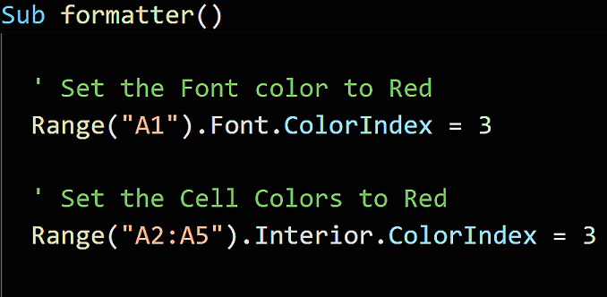
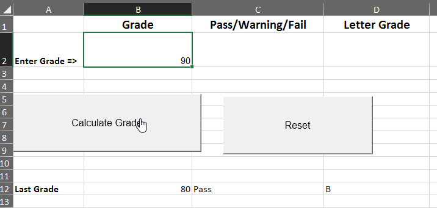
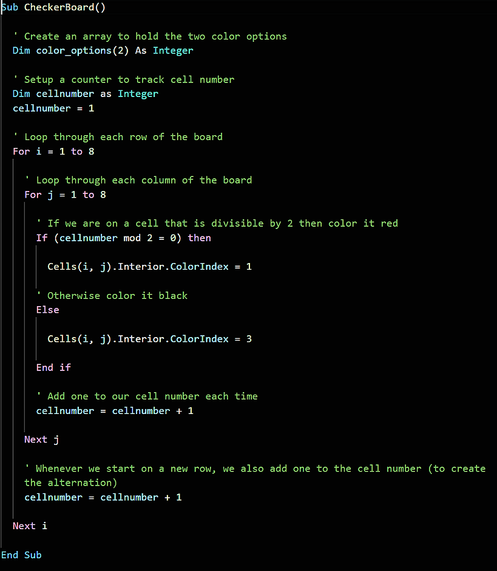
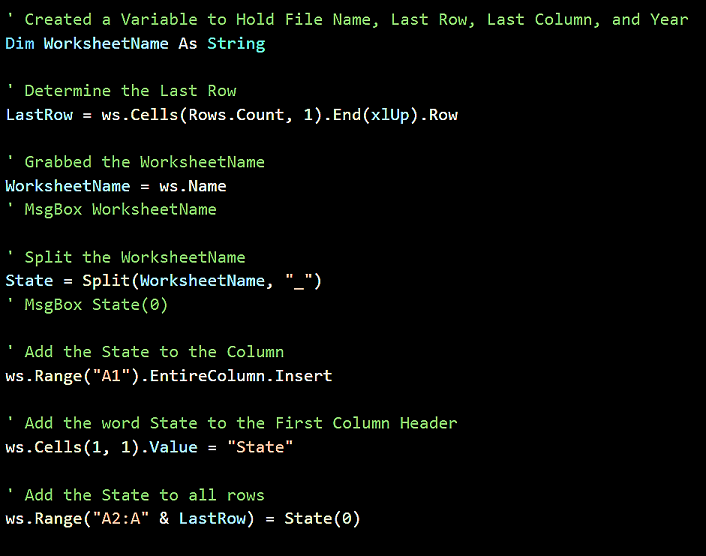
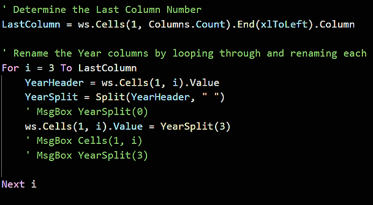

## 2.3 Lesson Plan - Getting Real with VBA

### Overview

Today will complete this in-depth week on VBA scripting with VBA Formatting and loops. During the second half of class, there will be a short project for students to work on.

- - -

### Class Objectives

* You should be comfortable formatting spreadsheets using VBA code

* You should understand how to loop through a table using VBA code and check for changes in values

- - -

### 01. Welcome 

* You have likely noticed how this unit has been far more challenging than the previous one. You may even be feeling a little stressed out or frustrated. Everything is going to be okay. For many of you, this week marks your first foray into programming, and no one expects perfection on the first go. As long as you put in the hours of practice and never give up hope, you will come out of this week with a strong understanding of basic programming.

### 02. Stars Counter (0:20)

* Activity 1 involves an Excel spreadsheet containing 50 rows of "review data" for Spanish and French online language programs. Using your knowledge of VBA, it is up to you to determine the total number of stars each user gave their respective programs and then find the total number of stars both programs received.

* **Files**

  * [StarCounter_Unsolved](Activities/01-Stu_StarsCounter/Unsolved/StarCounter_Unsolved.xlsx)

* **Instructions**

  * Create a VBA script that tallies the number of "Full Stars" per row and enters them into the Total column. Starter code is provided, but feel free to start from scratch if you want an extra challenge :-)

* **Bonus**

  * Instead of hard-coding the last number of the loop, use VBA to determine the last row automatically (i.e. do not use for i = 2 to 51)

  * Create two charts:

    * One to see if there is a relationship between Program Type and Rating (line chart)

    * The other to see if there is a relationship between Date and Rating (bar graph)

* **Hints**

  * You will need to use a nested for loop.

  * You will need to create a variable to hold the number of stars and continually reset this variable at the start of each row.

### 03. Review Star Counter 

* Open up [01-Stu_StarsCounter/Solved/StarCounter_Solved_WithVBA](Activities/01-Stu_StarsCounter/Solved/StarCounter_Solved_WithVBA.xlsm) and run through the code.

* Note the following:

  * The code loops through rows 2 to 51 in our first loop

  * It then loops through columns 4 to 8 for that row within the second loop

  * Every time we find a "Full-Star" value within a column, we add 1 to our `StarCounter`

  * The value of `StarCounter` is placed within a new cell after the conclusion of the second loop and then we move onto the next value in the first loop

  

  * To count all of the stars on the page, all that needs to be added is another variable, add to it just like `StarCounter`, and then not reset it on each new row.

### 04. VBA Formatting 

* Not only can we use VBA in order to change the values within cells, we can also code in formatting fairly easily using a variety of functions.

  

* Open up [ins_formatter.xlsm](Activities/02-Ins_Formatter/ins_formatter.xlsm). We will be using VBA to fill each of these cells with their respective colors.

  * Within the VBA editor, write the following code...

  

  

  * The text in cell A1 will be colored red

  * The interiors of cells A2 to A5 will be filled with red as well

  * You may be wondering where we got the value "3" from and how it corresponds to the color red... The answer is that Excel has split its palette up into 56 colors and given each of them a corresponding numeric value. You can find a handy-dandy chart for these values by following [this link](http://dmcritchie.mvps.org/excel/colors.htm).

* Now that you have a guide to the colors, create code that will color columns B, C, and D.

  

### 05. VBA Grade Book -- Home Exercise

* Now you are going to create an Excel application that checks a fictional student's grade and performs some actions based upon it.

  

* **Files**

  * [GradeBook_Unsolved](Activities/03-Stu_Gradebook/Unsolved/unsolved_grader.xls)

* **Instructions**

  * Create a grade calculator using conditionals. This calculator will convert a student's numeric grade into a letter grade, and style the result cell accordingly.

  * Once complete your script should perform the following:

    * If the score is over 90, the student will receive an "A" in the letter grade cell, and the Pass/Warning/Fail cell will be filled green with the text "Pass".

    * If the score is between 80 and 89 (inclusive), the student will receive a "B" in the letter grade cell, and the Pass/Warning/Fail cell will be filled green with the text "Pass".

    * If the score is between 70 and 79 (inclusive), the student will receive a "C" in the letter grade cell, and the Pass/Warning/Fail cell will be filled yellow with the text "Warning".

    * Finally, if the score is below a 70, the student will receive a "F" in the letter grade cell, and the Pass/Warning/Fail cell will be filled red with the text "Fail".

* **Bonus**

  * Create a second button that resets the grades to the original state and then establishes the previous grade in the Last Grade row.

### 06. Review Grade Book -- Home Exercise

* Open up [03-Stu_Gradebook/Solved/graderSolved.xlsm](Activities/03-Stu_Gradebook/Solved/graderSolved.xlsm) and run through the code.

* Note the following:

  * We are modifying the formatting/value of cells B2/C2 based upon the value stored within A2. When the value of A2 changes, so too does the formatting/value of cells B2/C2.

  * Due to the number of possible inputs, our code includes plenty of conditionals to account for every new letter grade.

  * For the bonus, the code simply needs to collect the previous values of A2, B2, and C2 before moving them into three new cells.

### 07. Checkerboard -- Home Exercise

* While this next activity does involve VBA formatting, the core goal is to help teach you coding logic.

* You must create an 8x8 checkerboard pattern using nothing but VBA scripts. This means creating a script which formats cells based upon whether they are determined to be even or odd.

  

* **Instructions**

  * Using VBA scripts, create an 8x8 grid with alternating red and black squares.

* **Hints**

  * You will need to use nested for loops, conditionals, mods and formatting to create the board.

  * This is a tricky problem! Try to pseudocode a plan first.

    * Unlike previous activities, this activity can be solved in a multitude of different ways. While some ways may be more efficient than others, simply finding a solution to the problem is a great start!

### 08. Review Checkerboard -- Home Exercise

* Open up [04-Stu_Checkerboard/Solved/checkerboard_solved.xlsm](Activities/04-Stu_Checkerboard/Solved/checkerboard_solved.xlsm) and run through the code.

* Note the following:

  * This solution is not the "correct" or even the "optimal" means by which we can solve this problem. There are many different potential solutions.

  * This solution uses two for loops, a variable, and an if/else conditional.

  * With each iteration of our loops, the variable goes up by one.

  * If the variable is even, the cell is formatted to be black. Otherwise, it is formatted to be red.

### 09. Looking to the Next Cell (Instructor Demo)

* When looping through rows and/or columns, it sometimes becomes necessary to check for changes and then run some alternative code based upon those changes.

  * A good example of this would be when you want to count how many rows contain a certain value and compare it to another series of rows containing a separate value.

* Open up [05-Ins_NextCells/NextCells.xlsx](05-Ins_NextCells/NextCells.xlsx) and copy the code from [05-Ins_NextCells/NextCells.vbs](05-Ins_NextCells/NextCells.vbs) into the VBA editor.

* Note how we are looping through the rows in the first column and printing a message to the screen whenever the value changes from one row to the next.

* Feel free to change the column variable to 2 and then 3 in order to see how this code is checking for changes in relation to the previous value. (Texas v New York, New York v Nebraska, Nebraska v Texas)

### 10. Card Checker (0:20)

* The primary purpose of this activity is to reinforce the concept of checking for changes in cell values and performing calculations whenever those changes occur.

* In this next activity, you will be using a VBA script in order to create a summary table based upon a series of values stored within an Excel spreadsheet.

* **Files**

  * [Credit Card Checker](Activities/06-Stu_CreditCardChecker/Unsolved/credit_charges_unsolved.xls)

* **Instructions**

  * Create a VBA script that will process the credit card purchases, identifying each of the unique brands listed.

  * For the *Basic* assignment, create a single pop-up message for each of the Credit Card brands listed by looping through the list.

  * For the *Advanced* assignment, tally the total credit card purchases for each Credit Card brand and add it to the summary table.

### 11. Review Card Checker 

* Open up [06-Stu_CreditCardChecker/Solved/credit_charges_solved.xlsm](Activities/06-Stu_CreditCardChecker/Solved/credit_charges_solved.xlsm) and run through the code.

* For the basic solution, note the following:

  * The code loops through all of the rows containing credit card purchases.

  * The code then checks for times where the contents of a cell in column A do not match the contents of the cell in the next row down.

  * Whenever the contents of the two cells do not match, we print the contents of the first cell to the screen before continuing on.

* For the advanced solution, note the following:

  * This code is very similar to the basic solution. The main difference is that it is now adding to the `Brand_Total` variable whenever a different value in column A is not found.

  * Whenever a change is found, the application will add the values of the final row to the total before placing the `Brand_Name` and `Brand_Total` into a summary table.

  * There is also a variable called `Summary_Table_Row` that keeps track of which row we should print the next line of data into so that there is no overwriting.

- - -
### 12. BREAK 
- - -

### 13. Wells Fargo Setup 

* For the rest of class, you will get into small groups in order to create a VBA script that takes an unmodified Excel workbook with several sheets of Wells Fargo data, formats each sheet so that they are more readable, and then combine all of the data into a single table.

* Teams should place one member of their group in charge of writing the code so that they all are working on the same workbook. This also ensures that they move at the same pace and work together on the assignment.

* This activity will be split into individual parts, and the class will come back together to review once each part has been completed.

### 14. Wells Fargo - Part I (0:30)

* This data is pretty raw and is not entirely easy to read. As such, you will start by creating a VBA script that loops through each worksheet in our workbook and formats them to be more readable.

* It is recommended that you create code that formats a single sheet first and then, once this has been accomplished successfully, modify the code to loop through and modify each worksheet within the workbook.

* **Files**

  * [07-Su_WellsFargo/Part1/Unsolved/Combined_Wells_Fargo.xlsx](Activities/07-Su_WellsFargo/Part1/Unsolved/Combined_Wells_Fargo.xlsx)

* **Instructions**

  1. Extract words before the phrase "_Wells_Fargo" to figure out which State.

  2. Add the State to the first column of each spreadsheet.

  3. Convert the headers of each row to simply say the year.

  4. Convert the numbers to currency values for all cells

* **Hints**

  * First work on getting the correct formatting on one sheet before moving onto creating a loop that formats each sheet within your workbook.

  * If you are looking for a good resource for finding the code to loop through all worksheets in a workbook, check out [this link](https://support.microsoft.com/en-us/help/142126/macro-to-loop-through-all-worksheets-in-a-workbook)

### 15. Review Wells Fargo - Part I (0:10)

* Open up [Wells_Fargo_Format.xlsm](Activities/07-Su_WellsFargo/Part1/Solved/Wells_Fargo_Format.xlsm) and run through the code with your class.

* Note the following:

  * To loop through all worksheets using VBA, we use a `For Each` loop that loops through the built-in array of `Worksheets`

  

  * To collect the state's name, the code looks at the name of the current worksheet - `ws.Name` - and then splits on underscores. It can then place the name alone by referencing `State(0)` since the state name is stored at index 0 in the `State` array.

  

  * To collect/convert the years for the sheet's columns, the code finds the final column, loops through columns 3 to the final column, splits the contents on spaces, and then places the value at index 3 into the cell.

  

  * Finally, to add the currency number format to our dataset, all the code needs to do is loop through all of the rows/columns from B2 onwards and apply the style of "Currency"

  

### 17. Wells Fargo - Part II (0:20)

* In this second part of the project, you will be combining all your previous sheets into one massive table on a new sheet.

  * This will require you to loop through each sheet, select each row of data, and move it into the new sheet.

* **Files**

  * [Wells_Fargo_Format.xlsm](Activities\07-Su_WellsFargo\Part2\Unsolved\Wells_Fargo_Format.xlsm)

* **Instructions**

  1. Loop through every worksheet and select the state contents.

  2. Copy the state contents and paste it into the Combined_Data tab

### 18. Review Wells Fargo - Part II (0:10)

