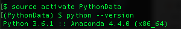
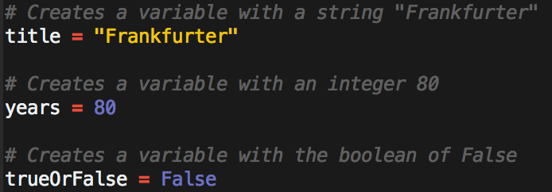
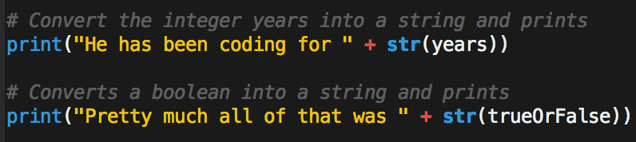
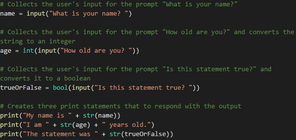
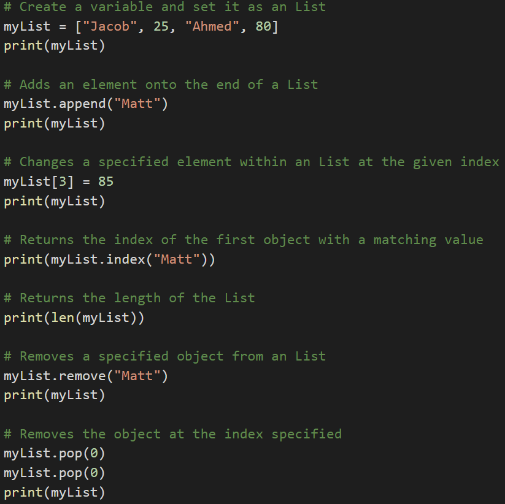
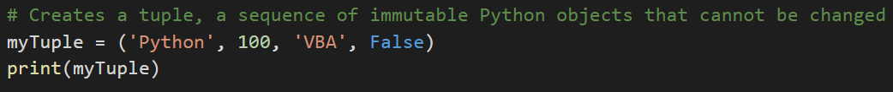
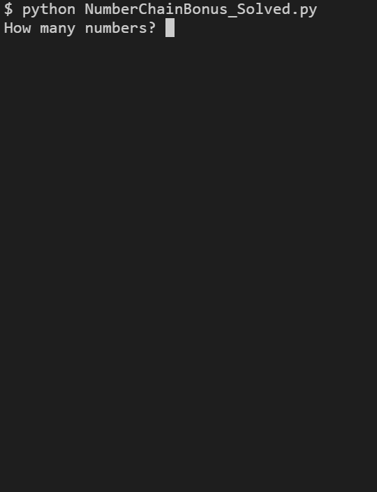

# 3.1 Lesson Plan - Let's Begin Python

### Overview

In today's class, students will transition from VBA to the programming language Python. Today's class will check Python installation for students, then cover the basics of terminal navigation, variables, conditionals and loops.

### Class Objectives

* Students should have Python 3 installed
* Students should be able to navigate their desktop via the terminal
* Students should be able to create Python scripts and run them in terminal
* Students should begin to understand programming concepts in Python

----

### 1. Intro to Python (5 min)

* The class is now going to move on to a more traditional programming language, Python. This will be the primary language for the next several weeks.

* The biggest change from VBA will be syntax, but the fundamental concepts are the same.

### 2. Check Anaconda installation (15 min)

* You should have installed all of this in your pre-work, but there is a good chance that you were not able to or had issues.

* Open up the console and follow along.

  * Enter `conda --version` which will display the version of Anaconda install.

    

* The most common issue will be students with Windows that don't have the Anaconda PATH variable set.

  * This can be fixed by manually adding the PATH to Windows's environment variables but can be more easily solved by uninstalling/reinstalling Anaconda and making sure to check the "Install to Path" box that comes up in a menu.

### 3. Create A Virtual Environment (10 min)

* Next, move on to [virtual environments](https://conda.io/docs/user-guide/tasks/manage-environments.html).

  * Virtual environments create an isolated environment for Python projects.

  * Different projects can have different dependencies.

  * Different project might also use different types and versions of libraries.

  * This virtual environment will make sure the class has all the right dependencies for future class activities.

* Create a virtual environment that will run Python 3.6. This will help solve issues where students have multiple versions of Python installed.

  * First run `conda create -n PythonData python=3.6 anaconda` in terminal. This may take a few minutes to install.

  * Now enter `source activate PythonData` to activate the environment. When `(PythonData)$` appears, this means you are in the environment.

  * Make sure you are using the correct version of Python by entering `python --version`

    

  * You can exit the environment by entering `source deactivate`

### 4. Terminal (5 min)

* Open up the terminal/console. Walk through what each of the following commands do:

  * `cd` (Changes the directory)

  * `cd ~` (Changes to the home directory)

  * `cd ..` (Moves up one directory)

  * `ls` (Lists files in folder)

  * `pwd` (Shows the current directory)

  * `mkdir <FOLDERNAME>` (Creates a new directory with the FOLDERNAME)

  * `touch <FILENAME>` (Creates a new file with the FILENAME)

  * `rm <FILENAME>` (Deletes a file)

  * `rm -r <FOLDERNAME>` (Deletes a folder, make sure to note the -r)

  * `open .` (Opens the current folder on Macs)

  * `explorer .` (Opens the current folder on Bash)

  * `open <FILENAME>` (Opens a specific file on Macs)

  * `explorer <FILENAME>` (Opens a specific file on Bash)

  

* Use [CommonCommands.txt](Activities/01-Ins_Terminal/CommonCommands.txt) as a reference.

* This is basic terminal navigation. Now, see how you can edit Python files and run them in the terminal.

  * Navigate into the `PythonStuff` folder on the desktop

  * Open `first_file.py` in the text editor

  * Add `print("This if my first Python file")` and save the code

  * Return to the terminal and run the file using `python first_file.py`

  * `python <FILENAME>.py` tells the computer that this is a Python file and to run the code contained within

  * Repeat again with `second_file.py` using the code `print("This is my second python file")`

  

### 5. Terminal (10 min)

* You will now dive into the terminal, create three folders, and a pair of Python files which will print some strings to the console.

* **Instructions**

  * Follow the below instructions in your terminal and write the commands below.

  * Create a folder called `LearnPython`

  * Navigate into the folder

  * Inside `LearnPython` create another folder called `Assignment1`

  * Inside `Assignment1` create a file called `quick_python.py`

  * Add a print statement to `quick_python.py`

  * Run `quick_python.py`

  * Return to the `LearnPython` folder

  * Inside `LearnPython` create another folder called `Assignment2`

  * Inside `Assignment2` create a  called `quick_python2.py`

  * Add a different print statement to `quick_python2.py`

  * Run `quick_python2.py`

### 5. Variables (7 min)

* Open up the file [variables.py](Activities/03-Ins_Variables/variables.py). Variables let us store information that we can later use.

  * VBA accessed certain values when they referred to a specific cell. This is essentially what a variable is doing in Python—a value is being stored there.

  * Variables can store different data types like strings, integers and a completely new data type called booleans which hold `True` or `False` values.

    

  * We can print statements which include variables, but Python can only print strings. This means integers and booleans must be cast as strings using the `str()` function.

    

### 6. Hello Variable World! (10 mins)

* It is now time to create a simple Python application that uses variables. It will both run calculations on integers and print strings out to the console.

* Open up [04-Stu_HelloVariableWorld](Activities/04-Stu_HelloVariableWorld/Solved/HelloVariableWorld.py) within the terminal and run the code.

* **Instructions**

  * Create two variables called `name` and `country` that will hold strings

  * Create two variables called `age` and `hourly_wage` that will hold integers

  * Create a variable called `satisfied` which will hold a boolean

  * Create a variable called `daily_wage` that will hold the value of `hourly_wage` multiplied by 8

  * Print out all of the above variables to the console

### 8. Inputs and Prompts (5 mins)

* Open up [inputs.py](Activities/06-Ins_Prompts/inputs.py) and then run the code within the terminal before opening the code up in the text editor.

  

* Note how the code does the following...

  * Takes input from the command line after printing a prompt to the terminal

  * The variable `name` will store the user's response to the prompt

  * Every response to an input is stored as a string regardless of the characters entered. As such, variables that are intended to be integers must be cast in order to be used in calculations.

  * The `bool()` function always returns `True` if any text is inside of it

  * Print statements can be concatenated with variables so long as they are also strings or are cast as strings

  

### 9. Down To Input (7 min)

* This exercise will give you a chance to work on storing inputs from the command line and run some code based upon the values entered.

* Open up [06-Stu_DownToInput](Activities/04-Stu_DownToInput/Solved/DownToInput.py) within the terminal and run the code.

  

* **Instructions:**

  * Create two different variables that will take the input of your first name and your neighbor's first name.

  * Create two more inputs that will ask how many months each of you have been coding.

  * Finally, display a result with both your names and the total amount of months coding.

### 11. Conditionals (7 min)

* Open up [conditionals.py](Activities/07-Ins_Conditionals/conditionals.py) within a text editor and run through the code.

* You should be familiar with conditionals after your time with VBA. The logic in Python is nearly the same. The primary difference is the syntax and indentation.

  * Python uses `if`, `elif`, and `else` for creating conditionals

  * Conditional statements are concluded with a colon but all lines after the colon **must** be indented in order to be considered a part of that code block. This is because Python reads blocks of code based on indentation.

    

  * All sorts of operators like greater than, less than, equal to, and much more can be used to create logic tests for conditionals.

  * Multiple logic tests can be checked within a single conditional statement. Using the term `and` must mean both tests return `True` while `or` require that only one test return as true.

  * Conditionals can even be nested, allowing programmers to run logic tests based upon whether or not the original logic test returned as `True`.

    

### 12. Conditional Conundrum (10 min)

* During this activity, you will be looking through some prewritten conditionals and attempting to figure out what lines will be printed to the console.

* **File:**

  * [conditionals_unsolved.py](Activities/08-Stu_conditionalConundrum/Unsolved/conditionals_unsolved.py)

* **Instructions:**

  * Look through the conditionals within the provided code and figure out which lines will be printed to the console.

  * Do not run the application at first. See if you can follow the thought process for each chunk of code and then place a guess. Only after coming up with a guess for each section should you run the application.

* **Bonus:**

  * After figuring out the output for all of the code chunks, create your own series of conditionals to test your fellow students. Once you have completed your puzzle, slack it out to everyone so they can test it.

----

### Break (15 min)

----

### 14. Lists (10 min)

* The next data type you will be uncovering is the list.

  * Lists are the Python equivalent of arrays in VBA, functioning in much the same way by holding multiple pieces of data within one variable.

  * Lists can hold multiple types of data inside of them as well. This means that strings, integers, and boolean values can be stored within a single list.

* Open [lists.py](Activities/09-Ins_List/lists.py) and see how a list called `myList` was created that contains a mix of data types:

  * The `append` method can add elements on to the end of a list

  * The `index` method return the numeric location of a given value within a list

  * The `len` function returns the length of a list

  * The `remove` method deletes a given value from a list

  * The `pop` method can be used to remove a value by index

  * Remember that indexing in lists starts at `0`, just like in arrays

  

* Python also has a data type called tuples that are functionally similar to lists in what they can store but are immutable.

  * While lists in Python can be modified after their creation, tuples can never be modified after their declaration.

  * Tuples tend to be more efficient to navigate through than lists and also protect the data stored within from being changed.

  * For more info on tuples, check this [quora question](https://www.quora.com/What-advantages-do-tuples-have-over-lists) out.

  

### 15. Rock, Paper, Scissors (15 min)

* During this time, you will be creating a simple game of Rock, Paper, Scissors that will run within the console.

* Open [RPS_Solved.py](Activities/10-Stu_RockPaperScissors/Solved/RPS_Solved.py) within the terminal and run the application.

  

* Open up [RPS_Unsolved.py](Activities/11-Stu_RockPaperScissors/Unsolved/RPS_Unsolved.py) within a text editor. This will be your starter code.

  * Note how the code imports a module called `random` that will allow the computer to randomly make a choice from a list of actions.

  * You will be diving more deeply into modules in the next class.

  * Look at the [documentation](https://docs.python.org/2/library/random.html) for the `random` module and note how, by importing the random library, you will now have access to all these functions within your code.

* **Files**

  * [RPS_Unsolved.py](Activities/10-Stu_RockPaperScissors/Unsolved/RPS_Unsolved.py)

* **Instructions:**

  * Using the terminal take an input of `r`, `p` or `s` which will stand for rock, paper, and scissors

  * Have the computer randomly pick one of these three choices as well

  * Compare the user's input to the computer's choice in order to determine if the user won, lost, or tied

* **Hints:**

  * Look into this [stackoverflow](https://stackoverflow.com/questions/306400/how-to-randomly-select-an-item-from-a-list) question for help on using the `random` module to select a value from a list.

### 17. Loops (10 min)

* The next topic, loops, was also covered during our VBA unit.

* Open up [11-Ins_Loops](Activities/11-Ins_Loops/LoopDeLoop.py) within a text editor and note the following...

  * The variable `x` is created within the loop statement and could theoretically take on any name as long as it is unique.

  * When looping through a range of numbers, Python will halt the loop one number before the final number. For example, when looping from 0 to 5, the code will run five times but `x` will only ever be printed as 0 through 4.

  * When provided with a single number, `range()` will always start the loop at 0. When provided with two numbers, however, the code will loop from the first number until it reaches one less than the second number.

    

  * Python can also loop through all of the letters within a string or all of the values stored within a list by using the syntax `for <variable> in <string or list>:`

    

  * `while` loops will run blocks of code just like a `for` loop does but will continue looping for as long as a condition is met.

    

### 18. Number Chain (15 min)

* Next up is a number chain exercise that will take user input and print out a string of numbers.

* Open up [NumberChain_Solved.py](Activities/12-Stu_NumberChain/Solved/NumberChain_Solved.py) and run the code. After that, open [NumberChainBonus_Solved](Activities/12-Stu_NumberChain/Solved/NumberChainBonus_Solved.py) and run the code.

* **Instructions:**

  * Using a `while` loop, ask the user "How many numbers?", and then print out a chain of ascending numbers from 0 to the number input.

  * After the results have printed, ask the user if they would like to continue. If "y" is entered, keep the chain running by inputting a new number and starting a new count from 0 to the number input. If "n" is entered, exit the application.

* **Bonus:**

  * Rather than just displaying numbers starting at 0, have the numbers start at the end of the previous chain.
