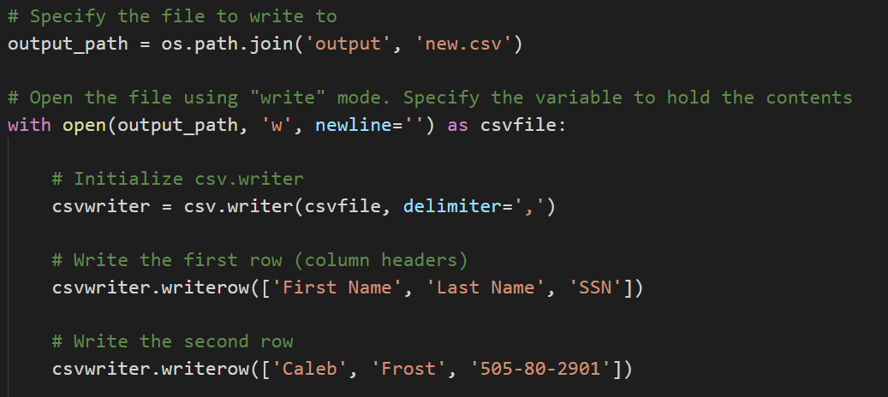
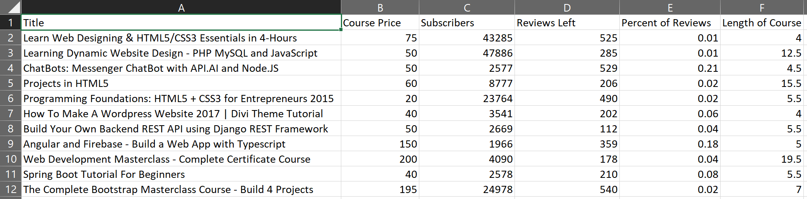
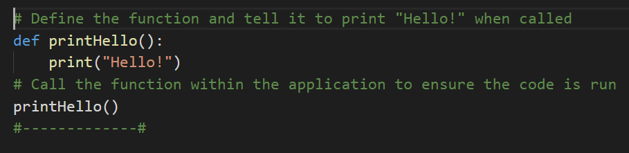
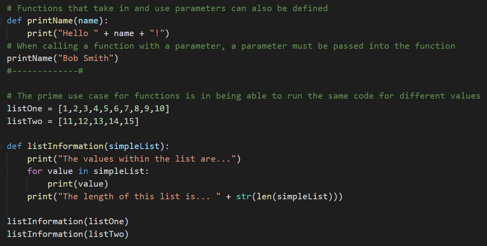
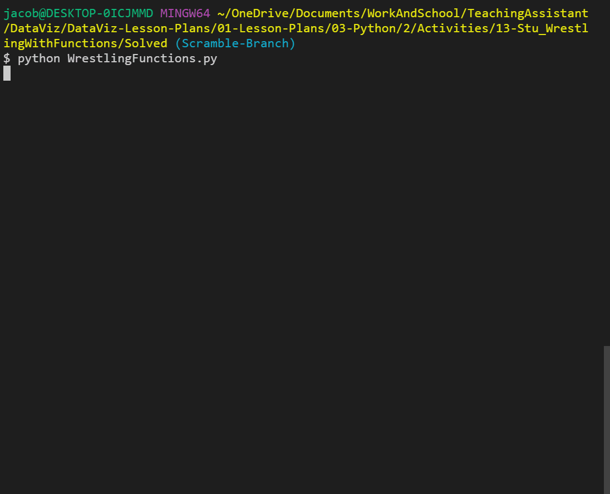

## 3.2 Lesson Plan - Reading, Writing, and Pyrithmetic

### Overview

During today's class, the class will be diving further into reading and writing data from/to external CSV files. They will also dive into Python dictionaries, zipping lists, and functions.

### Class Objectives

* Students should feel confident reading data into Python from CSV files

* Students should feel confident writing data from Python into CSV files

* Students should know how to zip two lists together and when this is helpful

* Students should have a firm understanding on how to create and use Python functions

---

### 1. Welcome Class (0:01)

* Welcome to today's class! Even though this stuff is tough, practice makes perfect. The more you work with Python, the more sense it will make.

### 2. Python Check-Up (0:10)

* Since last class introduced quite a lot of new material, today's lesson will start with a quick warmup activity to get the Python juices flowing!

* **Instructions:**

  * Create a simple Python command line application. Upon running, the application should:

    * Print "Hello User!"

    * Then ask: "What is your name? "

    * Then respond: "Hello <user's name>"

    * Then ask: "What is your age? "

    * Then respond: "Awww... you're just a baby!" or "Ah... A well traveled soul are ye." depending on the user's age.

* **Hints:**

  * Remember to cast your variables!

### 4. Loop Recap (0:05)

* Open up [02-Ins_SimpleLoops](Activities/02-Ins_SimpleLoops/SimpleLoops.py) within the editor to refresh yourself on how to create basic loops.

  * A `For` loop will loop through a range of numbers, the letters in a string, or the elements within a list one at a time.

  

  * A `While` loop will loop through the code contained inside of it until some condition is met.

  

### 5. Kid in a Candy Store (0:15)

* Pretend you are a kid going with your parents to the supermarket. After pestering your parents for a while, you are finally allowed to pick out some candy to take home.


* **Files:**

  * [KidInCandyStore_Unsolved.py](Activities/03-Stu_KidInCandyStore/Unsolved/KidInCandyStore_Unsolved.py)

* **Instructions:**

  * Create a loop that prints all of the candies in the store to the terminal with their index stored in brackets beside them.

    * For example: "[0] Snickers"

  * Create a loop that runs for a number of times as determined by the variable `allowance`.

    * For example: If allowance is equal to five, the loop should run five times.

  * Each time this second loop runs, take in a user's input - preferably a number - and then add the candy with a matching index to the variable `candyCart`.

    * For example: If the user enters "0" as their input, "Snickers" should be added into the `candyCart` list.

  * Use another loop to print all of the candies selected to the terminal.

* **Bonus:**

  * Create a version of the same code which allows a user to select as much candy as they want up until they say they do not want any more.

### 7. House of Pies (0:20)

* From one form of sweets to another. In this activity, the class will be constructing an order form that will display a list of pies and then prompt users to make a selection. It will continue to prompt for selections until the user decides to terminate the process.

* This activity comes in three parts: an easy version that is very much like the previous activity and a hard version which is very challenging. Try your luck on the hardest version if you are feeling confident!

* **Instructions:**

  * **Part 1**

    * Create an order form that will display a list of pies to the user in the following way:

    ```
    Welcome to the House of Pies! Here are our pies:

    ---------------------------------------------------------------------
    (1) Pecan, (2) Apple Crisp, (3) Bean, (4) Banoffee,  (5) Black Bun, (6) Blueberry, (7) Buko, (8) Burek,  (9) Tamale, (10) Steak
    ```

    * Then prompt the user to select which pie they'd like to order via number.

    * Immediately after, follow the order with `Great! We'll have that <PIE NAME> right out for you` and then ask if they would like to make another order. If so, repeat the process.

    * Once the user is done purchasing pies, print the total number of pies ordered.

  * **Part 2 (Very Challenging!)**

    * Modify the application once again, this time conclude the user's purchases by listing out the total pie count broken by *each* pie.

    ```
    You purchased:
    0 Pecan
    0 Apple Crisp
    0 Bean
    2 Banoffee
    0 Black Bun
    0 Blueberry
    0 Buko
    0 Burek
    0 Tamale
    1 Steak
    ```

### 9. Reading Text Files (0:05)

* Another feature of Python is that it is capable of reading data in from external text files and then performing some tasks on it.

* Open up [05-BasicRead](Activities/05-Ins_BasicRead/ReadFile.py) and [input.txt](Activities/05-Ins_BasicRead/Resources/input.txt).

  * When dealing with external files, Python requires very precise directions on what path to follow to reach the desired file. As such, if the desired file is stored within a sub-folder called "Resources", the path needed would be "Resources/FileName.txt".

  * It is critical to note that different operating systems use different paths to locate files. For example: Windows machines will often use forward slashes to seperate folders while Mac devices will use backslashes.

  

  * The `with` statement is simply saying that, for as long as we are dealing with the code within the following block, save the text variable. Once the code block has completed, the text variable will be "cleaned up" and removed to save memory.

  * `open(<File Path>, <Read/Write>)` is the function Python uses in order to open up and work with external text files. By specifying `'r'`, `'w'`, or `'rw'`, users can use the `open()` function to either read from a text file, write to a text file, or perform both operations within the following code block.

  * `text.read()` parses the data that is read in by the `open()` function and converts it into a string type. If this function was not used, all that would be printed to the screen would be an unhelpful textwrapper object.

  

### 10. Introduction to Modules (0:05)

* While Python includes many built-in functions, sometimes coders have to bring in external modules in order to perform specific tasks.

  * If a coder wanted a random number generator for a dice game they were making, for example, they would most likely want to use the `random` module instead of having to create the code from scratch.

* Importing modules into Python is actually very simple. All that is required is for the module to be installed and for the user to import the module into their code.

  * All of the modules for today come packaged with Python, so there is no need to install anything new.

* Open up [06-Ins_Modules](Activities/06-Ins_Modules/imports.py) within your editor.

  * The `string` module contains many helpful constants and methods which pertain to strings. For example, users can use `string.ascii_letters` and Python will instantly grab a reference to every ASCII character.

  
  

  * The `random` module does exactly what one might expect—it allows Python to randomly select values from sets, ranges, lists, or even strings.

  
  

### 11. Module Playground (0:05)

* There are tons of built-in modules for Python and there is no possible way that a single class could cover all of them. For the time being, however, take the opportunity to look through some of Python's modules and play around with them.

* The class will come back together after a couple of minutes to discuss some of the modules that were uncovered before moving on.

* **Links:**

  * [List of Built-In Python Modules](https:/docs.python.org/3/py-modindex.html)

### 12. Module Playground Review (0:05)

* See if there were any modules in particular that folks found useful. Have those students that answer stand and discuss the module they found and how it could be used.

----
### 13.  BREAK (0:10)
----

### 14. Reading In CSVs (0:05)

* While reading in text files can be useful in some circumstances, it is more likely within the data industry to run across files known as CSVs.

  * CSV stands for **C**omma **S**epeated **V**alues and is essentially a table that has been converted into text format with each row and column being seperated by specified symbols.

  * More often than not each row is located on a new line and each column is seperated by a comma. Seems simple enough since this is why the file type is called "Comma Seperated Values."

  

* Python has a module called `csv` which allows its users to easily pull in data from external CSV files and perform some operations upon them.

* Open up [07-ReadCSV](Activities/07-Ins_ReadCSV/ReadCSV.py) within the editor and go over the code contained within.

  * The first major piece of code to notice is the importing and usages of the `os` module. This module allows Python programmers to very easily create dynamic paths to external files that function across different operating systems.

  

  * The second major point to make is that the code is still using the `with open()` syntax from earlier to read in the file originally. The key difference here is that this code now includes the `newline=''` parameter. This tells Python that each time the CSV file goes down a line, it should be considered a new row.

  * Instead of `text.read()`, this new code instead utilizes `csv.reader()` to translate the object being opened by Python. It is critical to note the `delimiter=','` parameter being used as this tells Python that each comma within the CSV should be seen as moving into a new column for a row.

  

  * The code then loops through each row of the CSV and prints out the contents. Note how each value is being shown as a string and how all of the rows are lists.

  

### 15. Reading Netflix (0:10)

* In this activity, you will be provided with a CSV file containing data taken from Netflix. You will then create an application that searches through the data for a specific movie/show and returns the name, rating, and review score for it.


* **File:**

  * [Netflix_Ratings.csv](Activities/08-Stu_ReadNetFlix/Resources/netflix_ratings.csv)

* **Instructions:**

  * Prompt the user for what video they are looking for.

  * Search through the `netflix_ratings.csv` to find the user's video.

  * If the CSV contains the user's video, then print out the title, what it is rated, and the current user ratings.

    * For example: `'Pup Star is rated G with a rating of 82'`

* **Bonus:**

  * If the CSV does not contain the user's video, then print out a message telling them that their video could not be found.

### 17. Writing CSVs (0:05)

* Not only can Python read data in from CSV files, it is also wholly capable of writing data into CSV files as well.

  * While this may not seem handy at first, it allows Python users to very easily modify and/or create datasets based upon previous data.

* Open up [09-WriteCSV](Activities/09-Ins_WriteCSV/Write.py) within the editor and go through the code.

  * The syntax for writing into a CSV file is thankfully very similar to that used to read data in from an external file.

  * First, the code references the path that will point into the CSV file the user would like to write to.

  * Next, the `with open()` statement is used once more but with one significant difference. Instead of the parameter `'r'` being passed and directing Python to read a file, the parameter `'w'` is passed in its stead to inform Python to write to the file.

  * Instead of `csv.reader()`, `csv.writer()` is used to once again inform Python that this application will be writing code into an external CSV file.

  * To write a new row into a CSV file, simply use the `csv.writerow(<DATA LIST>)` function and pass in an array of data as the parameter.

  

* Run the code and then open up the newly created CSV file to see that the application was successful.

### 18. Zipping Lists (0:05)

* While it is possible to write new rows of data into a CSV file using a bunch of `csv.writerow()` statements, Python users can far more efficiently write data into a new CSV file by using the `zip()` function.

  * `zip()` takes in a series of lists as its parameters and joins them together into a stack.

* Open up [10-Zip](Activities/10-Ins_Zip/zipper.py) within the editor and go through the code with the class.

  * This application has three lists, all of which pertain to each other and are of the same length. By zipping these lists together, there is now a single joined list whose indexes reference all three of the lists inside.

  * Zipped lists are turned into tuples. This means that the lists inside of a zip can no longer be modified or added to in any way.

  
  

### 19. Udemy Zip (0:15)

* Now that you have a decent idea of how to write/read data to/from CSV files, you will now take a large dataset from Udemy, clean it up, and create a new CSV file that is far easier to comprehend.



* **File:**

  * [WebDevelopment.csv](Activities/11-Stu_UdemyZip/Resources/WebDevelopment.csv)

* **Instructions:**

  * Create a Python application that reads the data on Udemy Web Development offerings.

  * Then store the contents of the Title, Price, Subscriber Count, Number of Reviews, and Course Length into Python Lists.

  * Then zip these lists together into a single tuple.

  * Finally, write the contents of your extracted data into a CSV. Make sure to include the titles of these columns in your csv.

* **Notes:**

  * As, with many datasets, the file does not include the header line. Use this as a guide to the columns: "id,title,url,isPaid,price,numSubscribers,numReviews,numPublishedLectures,instructionalLevel,contentInfo,publishedTime"

* **Bonus:**

  * Find the percent of subscribers that have also left a review on the course. Include this in your final output.

  * Parse the string associated with course length, such that we store it as an integer instead of a string. (i.e. "4 hours" should be converted to 4).

### 21. Introduction to Functions (0:05)

* Within the field of coding there is a popular acronym - DRY - which many coders live by. It stands for **D**ont **R**epeat **Y**ourself and essentially states that code should avoid having similar/repeating lines whenever possible.

* One of the best ways to prevent repetition is through the liberal usage of Python functions.

  * A function is a block of organized, reusable code that is used to perform a single, related action. In other words, functions are placeable blocks of code that perform a specific action.

* Open up [12-Ins_Functions](Activities/12-Ins_Functions/functions.py) within the editor and run through the code.

  * To create a new function, simply use `def <Function Name>():` and then place the code that you would like to run within the block underneath it.

  * In order to run the code stored within a function, the function itself must be called within the program. Functions will never run unless called upon.

  

  * Functions that take in parameters can also be created by simply adding a variable into the parentheses of the function's definition. This allows specific data to be passed into the function for usage.

  

### 22. Wrestling With Functions (0:10)

* Within the world of wrestling, there are winners and losers. The winners are labeled as "Superstars," while the losers are given the lowly title of "Jobber." Using a function, create the code necessary to search through a list of wrestlers and determine their win, loss, and draw percentages.



* **Files:**

  * [WrestlingFunctions_Unsolved.py](Activities/13-Stu_WrestlingWithFunctions/Unsolved/WrestlingFunctions.py)

  * [WWE-Data-2016.csv](Activities/13-Stu_WrestlingWithFunctions/Resources/WWE-Data-2016.csv)

* **Instructions:**

  * Analyze the code and CSV provided, looking specifically for what needs to still be added to the application.

  * Using the starter code provided, create a function called `getPercentages` which takes in a parameter called `wrestlerData` and does the following...

    * Uses the data stored within `wrestlerData` to calculate the percentage of matches the wrestler won, lost, and drew over the course of a year.

    * Prints out the stats for the wrestler to the terminal.

* **Bonus:**

  * Still within the `getPercentages()` function, create a conditional that checks a wrestler's loss percentage and prints either "Jobber" to the screen if the number was greater than fifty or "Superstar" if the number was less than 50.
