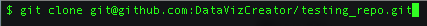
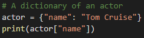
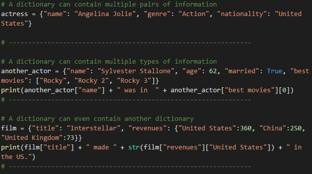
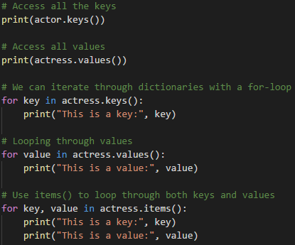
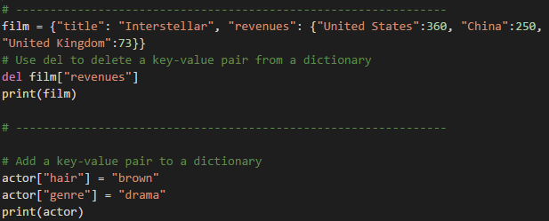
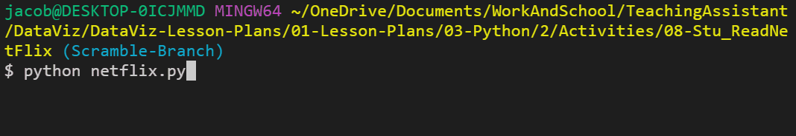
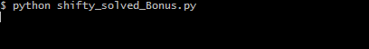
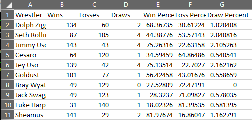

## 3.3 Lesson Plan - A Review In Python

### Overview

Today's class will wrap up the students' introduction to Python whilst teaching them basic coding logic and reasoning. During the second half of the class, students can either choose to work in a review group or challenge themselves a bit more by joining a challenge group.

- - -

### Class Objectives

* Students should be able to add, commit, and push code up to GitHub from the command line.

* Students should be able to create and use Python dictionaries.

* Students should be able to read data in from a dictionary.

* The class should have a firm understanding of coding logic and reasoning.

* Students in the refresher group should feel far more comfortable in their understanding of Python.

* Students in the challenge group should see how powerful Python can be in solving tough problems.

- - -

### 1. Welcome Students (1 min)

* Today will be a chance for you to regroup and catch your breath. You have learned a lot over the past week and, as such, there will only be one new concept introduced during today's class while the rest will focus far more heavily upon review.

* Before diving into the warmup activity, however, you will first cover a more practical way to use GitHub by using the command line.

* There will be a heavy focus on coding logic today. This means that you will be asked to describe in greater detail how you came up with your solutions to coding problems.

### 2. Intro to Git (0:30)

* So far, GitHub has only been used as a sort of drop box to store our files. Although GitHub works well this way, there is so much more that it is capable of. Today, there will be a deeper dive into what Git is and how to use it through the terminal to interact with GitHub.

* Git is essentially a way for us to keep track of our work over time.

  * Whenever we get another piece of a project working, we can save the change with Git.

  * This "save" is called a **commit** and represents a "checkpoint" for our project.


* If we break something in our code while developing, this system allows us to restore the working code from before.

* Since Git remembers these "checkpoints", we can work on several different concerns all at once.

  * Suppose we need to analyze Uber ride data for our project.

  * We might decide to analyze the average age of riders. Git essentially allows us to write this code and save it with the name: `age analysis`.

* This code is _different_ from the code we started with, and it lives separately from it.

  * In this scenario, we have a version of the code called `master`—that is the "main" version of our code—and a version called `age analysis` that contains updates.

* Each version of the code lives on a different **branch**.

  * A **branch** is essentially a history of changes.

  * In this case, we say that the `age analysis` branch **diverged** from the `master` branch.

  * Take a moment to examine the difference between the files on the `age_analysis` and `master` branches.

* Saving the age analysis code in a different branch gives our teammates a chance to review it for errors and offer suggestions.

* After the proposed change has been reviewed, we can update `master` branch to include the changes in `age analysis` by doing a **merge**.

* **Merging** two branches combines them into one branch.

* This is how we can work on new features or bugfixes without making changes to code we know is working.

  * This also makes easy to work with teammates, as people can avoid stepping on each others' toes by working on different branches.

* Finally, take a moment to review Git's "Snapshot model":

> "...Git thinks of its data more like a set of snapshots of a miniature filesystem. Every time you commit, or save the state of your project in Git, it basically takes a picture of what all your files look like at that moment and stores a reference to that snapshot. To be efficient, if files have not changed, Git doesn’t store the file again, just a link to the previous identical file it has already stored. Git thinks about its data more like a stream of snapshots."


### 3. Adding Files from the Command Line (10 min)

* So far, you have only added files using the website, which has been ok when only dealing with one or two files. This is ok when dealing with small amount of files across only one user. What happens when there are multiple files that need to be quickly added? This is where the command line comes in. Follow along with creating a repo and adding files with Terminal/Bash.

  * Create a new repo.

  * From repo page, click the green box in the top right "Clone or download", select "Use SSH" and copy the link to the clipboard.

  

  * Open terminal (or git-bash for Windows users) and navigate to the home folder using `cd ~`.

  * Type in `git clone <repository link>` in the terminal to clone the repo to the current directory. Once this has run, you should now see a folder with the same name as the repo.

    

  * Open the folder in VS Code and create two python script files named `script01.py` and `script02.py`.

  * Once the files have been created, open up Terminal/git-bash and navigate to the repo folder. Run the following lines and explain each as you go through them.

  ```bash
  # Displays that status of files in the folder
  git status

  # Adds all the files into a staging area
  git add .

  # Check that the files were added correctly
  git status

  # Commits all the files to your repo and adds a message
  git commit -m <add commit message here>

  # Pushes the changes up to GitHub
  git push origin master
  ```

  * Finally navigate to the repo on [Github.com](https://github.com/) to see that the changes have been pushed up.

### 4. Adding More to the Repo

* **Instructions**

  * Using the repo that you just created, make or add the following changes:

    * Add new lines of code to one of the python file.
    * Create a new folder
    * Add a file to the newly created folder.
    * Add, commit, and push the changes.
    * Delete the new folder.
    * Add, commit, and push the changes again.

### 5. Review Git (5 min)

* This will be the new primary way of submitting homework to GitHub (no more manual uploads!).

* It's ok if this takes some time to figure out.  By the end of the course, you will be a Git ninja!

* Continue to add and commit your activities today into a repo for additional practice.

### 6. Cereal Cleaner (10 min)

* To start today's class off, you will be creating an application that reads in cereal data from a CSV and then prints only those cereals that have more than 5 grams of fiber in them.

* **Files**

  * [cereal.csv](Activites/01-Stu_quick_read/cereal.csv)

  * [cereal_bonus.csv](Activites/01-Stu_quick_read/Resources/cereal_bonus.csv)

* **Instructions**

    * Read through `cereal.csv` and find all of the cereals that contain five grams of fiber or more, printing the data from those rows to the terminal.

* **Hint**

    * Everything within the CSV is stored as a string, and certain rows have a decimal. This means that they will have to be cast in order to be used.

    * Integers in Python are whole numbers and, as such, cannot contain decimals. As such, your numbers containing decimal points will have to be cast as a `float` or `double`.

* **Bonus**

    * Try the following again but this time using `cereal_bonus.csv`, which includes a header.

### 8. Dictionaries (5 min)

* Another data type that is commonly used in Python is the dictionary.

  * Like lists and tuples, dictionaries can contain multiple values and types of data within them.

  * Unlike lists and tuples, however, dictionaries store data in key-value pairs. The key in a dictionary is a string that can be referenced in order to collect the value it is associated with.

* Open up [dictionaries.py](Activities/02-Ins_Dicts/dictionaries.py). Note the following...

  * A pair of curly-braces can be used to create a dictionary: `variable = {}`

  * Values can be added to dictionaries at declaration by creating a key that is stored within a string, following it with a colon, and then placing the value desired afterwards.

  * Referencing a value within a dictionary is as simple as calling the dictionary and following it up with a pair of brackets containing the key for the value desired.

    

  * Dictionaries can hold multiple pieces of information by following up each key-value pairing with a comma and then placing another key-value pair afterwards.

  * Dictionaries can also store lists. They can be accessed by first calling the key and then indexing the list. You just need a basic understanding of this for now—when you get into APIs, you will get a lot more practice.

  * Dictionaries can also contain other dictionaries. In order to access the values inside nested dictionaries, simply add another key to the reference.

    

  * It is important to note how dictionaries in Python will always auto-sort alphabetically. This means that the order in which key-value pairs were declared many not be the order they would be when printed in the console.

### 9. Hobby Book (10 min)

* Next, you will get practice with creating and accessing dictionaries based upon your hobbies.

* **Instructions:**

  * Create a dictionary that will store the following:

    * Your name
    * Your age
    * A list of a few of your hobbies
    * A dictionary of a few times you wake up during the week

  * Print out your name, how many hobbies you have, and a time you get up during the week.

### 11. Keys and Values (5 min)

* Open up [key_values.py](Activities/04-Ins_keys_values/keys_values.py) and go through the code one block at a time. While running the code within the terminal, be sure to note:

  * All keys in a dictionary can be accessed by using the `keys()` method.

  * Similarly, all values in a dictionary can be accessed using the `values()` method.

  * The `keys()` and `values()` methods can also be used to iterate through a dictionary using a `for` loop.

  * The entire dictionary - both keys and values - can be iterated through by using the `items()` method.

    

  * The `del()` function can be used to remove a key-value pair by referencing the dictionary and key within

  * To add or update values within a dictionary, simply create a reference to the key desired and then set it equal to the value desired.

    

### 12. Store Manager (20 min)

* For this activity, you will be creating a console application for a retailer that helps them add, remove, or modify the items that are in their stock.

* **Instructions:**

  * Create a dictionary that has a few items already stored within it.

  * Prompt the user if they would like to add a new item, remove an existing one, or to display all the items currently in stock.

  * If the user would like to add a new item, ask what they would like to add and how many. Add the results to your dictionary.

  * If the user wants to remove and item, first check if that item is available, then remove that item from the dictionary.

  * If the user wants to display the result, print out an easy-to-read list of all the items and amounts to the console.

  * Ask the user if they would like to continue working within the application or stop the operation. Depending on the input, either run the application again or stop the application.

* **Bonus:**

  * If the application stops, all of the changes made to the original dictionary will be lost. Come up with a plan on how it might be possible to save data between one operation of the application and the next.

### 14. Group Break-Out

* Students will be splitting up into a review group and a challenege group after break.

* There is no benefit or advantage to either, so be honest with your assessment of your Python skills. This will be a good chance for you to catch your breath and go over previous exercises or dive in and tackle some harder problems.

- - -

### Break (40 min)

- - -

### 15. Group Split

* Break apart into groups.

- - -

**Review Group**

- - -

### 16. Review Group

* This group will be going over previous exercises that were important to understand for completing the homework.

* As you go through exercises, you should feel free to use old code snippets and the concepts you have learned since to come up with solutions. There is value in going back and reworking old code to reach higher standards.

* Students should ask questions, work with each other, and take time fully let concepts soak in.

* The following list of exercises are recommended for review. If there were other problems that you really struggled on, however, feel free to review those instead.

  * [06-Stu_conditionals](Activities/06-Stu_conditionals/Solved/basic_variables_solved.py)

  * [07-Stu_RockPaperScissors](Activities/07-Stu_RockPaperScissors/Solved/RPS_Solved.py)

  * [08-Stu_NumberChain](Activities/08-Stu_NumberChainSolved/Solved/NumberChain_Solved.py)

  * [09-Stu_ReadNetflix](Activities/09-Stu_ReadNetflixSolved/netflix.py)

  * [10-Stu_UdemyZip](Activities/10-Stu_UdemyZipSolved/Solved/wev_solved.py)


### 17. Conditionals (10 min)

* During this activity, you will be looking through some prewritten conditionals and attempting to figure out what lines will be printed to the console.

* **File:**

  * [conditionals_unsolved.py](Activities/06-Stu_conditionalConundrum/Unsolved/conditionals_unsolved.py)

* **Instructions:**

  * Look through the conditionals within the provided code and figure out which lines will be printed to the console.

  * Do not run the application at first, see if you can follow the thought process for each chunk of code and then place a guess. Only after coming up with a guess for each section should you run the application.

* **Bonus:**

  * After figuring out the output for all of the code chunks, create your own series of conditionals to test your fellow students. Once you have completed your puzzle, Slack it out to everyone so they can test it.

### 19. Rock, Paper, Scissors (15 min)

* During this time, you will be creating a simple game of Rock, Paper, Scissors that will run within the console.

* Open up [RPS_Unsolved.py](Activities/11-Stu_RockPaperScissors/Unsolved/RPS_Unsolved.py) within a text editor. This will be your starter code.

  * Note how the code imports a module called `random` that will allow the computer to randomly make a choice from a list of actions.

  * Read the [documentation](https://docs.python.org/2/library/random.html) for the `random` module and note how, by importing the random library, you will now have access to all those functions within your code.

* **Files**

  * [RPS_Unsolved.py](Activities/07-Stu_RockPaperScissors/Unsolved/RPS_Unsolved.py)

* **Instructions:**

  * Using the terminal take and input of `r`, `p` or `s` which will stand for rock, paper, and scissors

  * Have the computer randomly pick one of these three choices as well

  * Compare the user's input to the computer's choice in order to determine if the user won, lost, or tied.

* **Hints:**

  * Look into this [stackoverflow](https://stackoverflow.com/questions/306400/how-to-randomly-select-an-item-from-a-list) question for help on using the `random` module to select a value from a list.

### 21. Number Chain (15 min)

* Next up is a number chain exercise that will take user input and print out a string of numbers.


* **Instructions:**

  * Using a `while` loop, ask the user "How many numbers?", and then print out a chain of ascending numbers from 0 to the number input.

  * After the results have printed, ask the user if they would like to continue. If "y" is entered, keep the chain running by inputting a new number and starting a new count from 0 to the number input. If "n" is entered, exit the application.

* **Bonus:**

  * Rather than just displaying numbers starting at 0, have the numbers start at the end of the previous chain.

### 23. Reading Netflix (0:10)

* In this activity, you will be provided with a CSV file containing data taken from Netflix. You will then create an application that searches through the data for a specific movie/show and returns the name, rating, and review score for it.



* **File:**

  * [Netflix_Ratings.csv](Activities/09-Stu_ReadNetFlix/Resources/netflix_ratings.csv)

* **Instructions:**

  * Prompt the user for what video they are looking for.

  * Search through the `netflix_ratings.csv` to find the user's video.

  * If the CSV contains the user's video, then print out the title, what it is rated, and the current user ratings.

    * For example: `'Pup Star is rated G with a rating of 82'`

* **Bonus:**

  * If the CSV does not contain the user's video, then print out a message telling them that their video could not be found.

### 25. Udemy Zip (0:15)

* Now that you have a decent idea on how to write/read data to/from CSV files, you will now take a large dataset from Udemy, clean it up, and create a new CSV file that is far easier to comprehend.


* **File:**

  * [WebDevelopment.csv](Activities/10-Stu_UdemyZip/Resources/WebDevelopment.csv)

* **Instructions:**

  * Create a Python application that reads the data on Udemy Web Development offerings.

  * Then store the contents of the Title, Price, Subscriber Count, Number of Reviews, and Course Length into Python Lists.

  * Then zip these lists together into a single tuple.

  * Finally, write the contents of your extracted data into a CSV. Make sure to include the titles of these columns in your csv.

* **Notes:**

  * As, with many datasets, the file does not include the header line. Use this as a guide to the columns: "id,title,url,isPaid,price,numSubscribers,numReviews,numPublishedLectures,instructionalLevel,contentInfo,publishedTime"

* **Bonus:**

  * Find the percent of subscribers that have also left a review on the course. Include this in your final output.

  * Parse the string associated with course length, such that we store it as an integer instead of a string. (i.e. "4 hours" should be converted to 4).

- - -

 **Challenge Group**

- - -

* For students with a pretty good understanding of Python and looking to add a little bit more of a challenge to their day, this group will go over some new exercises.

### 28. Shifty

* The Caesar cipher is one of the simplest forms of cryptography out there, as all it does is shift letters a certain number of places down the alphabet. You will now create your own application that takes in a word or phrase and then prints out a shifted version of it to the screen.



* **Instructions**

    * Create a script that will shift each letter in a word over by the number given. If the shift would move past the end of the alphabet, loop back to the beginning.

      * For example `cat` with a shift of 3 would be `fdw` and `zoo` with a shift of 2 would be `bqq`

* **Bonus**

  * Make it so your shifty script is capable of handling a sentence. This means ensuring the code is capable of handling spaces and punctuation.

### 30. Wrestling Write

* You will now clean up multiple spreasheets of wrestling data using a single Python application.



* **Files:**

  * [WWE-Data-2013](Activities/12-Stu_WrestlingWrite/raw_data/WWE-Data-2013.csv)
  * [WWE-Data-2014](Activities/12-Stu_WrestlingWrite/raw_data/WWE-Data-2014.csv)
  * [WWE-Data-2015](Activities/12-Stu_WrestlingWrite/raw_data/WWE-Data-2015.csv)
  * [WWE-Data-2016](Activities/12-Stu_WrestlingWrite/raw_data/WWE-Data-2016.csv)
  * [WWE-Data-2017](Activities/12-Stu_WrestlingWrite/raw_data/WWE-Data-2017.csv)

* **Instructions:**

  * Create a script that will loop through all of the years of wrestling data provided, perform some calculations, and then create new CSV files containing new columns of data.

  * The updated CSV files should contain...

    * Wrestlers name
    * Wins
    * Win Percentage
    * Losses
    * Loss Percentage
    * Draws
    * Draw percentage

  * Make certain to add headers to the first row of each new data sheet.

- - -

**End Breakout**

- - -

### 32. End Class

* Next week, we will be getting into the Python library Pandas. It will be different from the type of Python we have been doing, but will be the first library  we use that is built for data.
