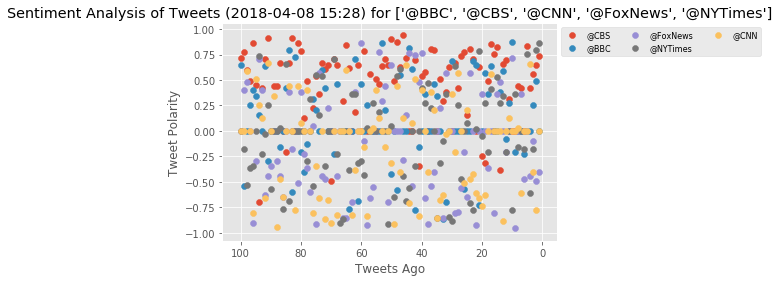
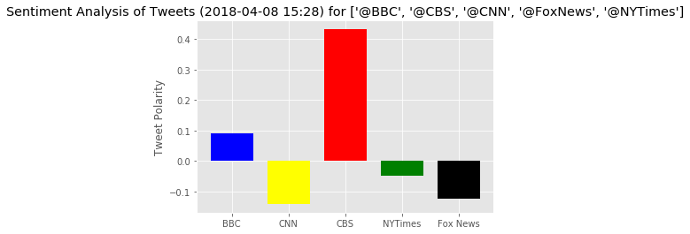

```
from datetime import datetime
import tweepy
import json
import numpy as np
import matplotlib.pyplot as plt
import pandas as pd
from vaderSentiment.vaderSentiment import SentimentIntensityAnalyzer
analyzer = SentimentIntensityAnalyzer()
from config import consumer_key, consumer_secret, access_token, access_token_secret
from matplotlib import style
style.use('ggplot')

# Setup Tweepy API Authentication
auth = tweepy.OAuthHandler(consumer_key, consumer_secret)
auth.set_access_token(access_token, access_token_secret)
api = tweepy.API(auth)
```


```
news_outlets = ["@BBC", '@CBS', '@CNN', '@FoxNews', '@NYTimes']

n_tweets = 100

sentiment = []
compound_list = []
neutral_list = []
positive_list = []
negative_list = []
name = []
counter_list = []
overall_compound =[]
overall_outlet = []
date = []
text = []
for outlet in news_outlets:
    overall_list = []
    overall_name = ''
    counter = 0
    for status in tweepy.Cursor(api.user_timeline, id=outlet, tweet_mode="extended").items(n_tweets):
        tweet = status._json
        result = analyzer.polarity_scores(tweet['full_text'])
        #get name, counter and compound scores
        name.append(tweet['user']['name'])
        compound_list.append(result['compound'])
        positive_list.append(result['pos'])
        negative_list.append(result['neg'])
        neutral_list.append(result['neu'])
        date.append(tweet['created_at'])
        text.append(tweet['full_text'])
        counter += 1
        counter_list.append(counter)        
        #get overall name and compound score to mean
        overall_list.append(result['compound'])
        overall_name = tweet['user']['name']
    overall_compound.append(np.mean(overall_list))
    overall_outlet.append(overall_name)
    
sentiment.append({
    "name": name,
    "compound_score" : compound_list,
    "date": date
    })

```


```
overall_df = pd.DataFrame({
    "News Outlet": overall_outlet,
    "Compound Score" : overall_compound,
    })
# overall_df
```


```
# compound_list
```


```
sentiment_df = pd.DataFrame({
    "name": name,
    "compound_score" : compound_list,
    "positive_score" : positive_list,
    "negative_score" : negative_list,
    "neutral_score" : neutral_list,
    "text": text,
    "date": date
    })
# sentiment_df.head(50)
# sentiment_df.columns
```


```
sentiment_df.to_csv("twitter_sentiment.csv")
```


```
sentiment_df["date"] = pd.to_datetime(sentiment_df["date"])
# sentiment_df.head(100)
```


```
sentiment_df.sort_values("date", inplace=True, ascending=True)
sentiment_df.head()
```


<div>
<style scoped>
    .dataframe tbody tr th:only-of-type {
        vertical-align: middle;
    }

    .dataframe tbody tr th {
        vertical-align: top;
    }

    .dataframe thead th {
        text-align: right;
    }
</style>
<table border="1" class="dataframe">
  <thead>
    <tr style="text-align: right;">
      <th></th>
      <th>compound_score</th>
      <th>date</th>
      <th>name</th>
      <th>negative_score</th>
      <th>neutral_score</th>
      <th>positive_score</th>
      <th>text</th>
    </tr>
  </thead>
  <tbody>
    <tr>
      <th>199</th>
      <td>0.7177</td>
      <td>2018-03-01 14:15:29</td>
      <td>CBS</td>
      <td>0.000</td>
      <td>0.800</td>
      <td>0.200</td>
      <td>.@ChrisStapleton, @ThomasRhett, @mirandalamber...</td>
    </tr>
    <tr>
      <th>198</th>
      <td>0.7717</td>
      <td>2018-03-01 14:29:20</td>
      <td>CBS</td>
      <td>0.000</td>
      <td>0.675</td>
      <td>0.325</td>
      <td>RT @ACMawards: Please give a round of applause...</td>
    </tr>
    <tr>
      <th>197</th>
      <td>0.5994</td>
      <td>2018-03-01 14:36:21</td>
      <td>CBS</td>
      <td>0.000</td>
      <td>0.822</td>
      <td>0.178</td>
      <td>RT @ACMawards: Congratulations to this year’s ...</td>
    </tr>
    <tr>
      <th>196</th>
      <td>0.4885</td>
      <td>2018-03-01 18:10:50</td>
      <td>CBS</td>
      <td>0.151</td>
      <td>0.615</td>
      <td>0.234</td>
      <td>RT @KeithUrban: ACMs...... HOLY SMOKES!!!!! MA...</td>
    </tr>
    <tr>
      <th>195</th>
      <td>0.8591</td>
      <td>2018-03-01 18:11:50</td>
      <td>CBS</td>
      <td>0.000</td>
      <td>0.462</td>
      <td>0.538</td>
      <td>RT @KelseaBallerini: Ohhhhh goodness. Incredib...</td>
    </tr>
  </tbody>
</table>
</div>


```
# sentiment_df[sentiment_df['name'] == "CBS"]
```


```
# plt.scatter(np.arange(-len(sentiment_df['date']), 0, 1), sentiment_df['compound_score'])

plt.scatter(np.arange(-len(sentiment_df[sentiment_df['name'] == "CBS"]),0,1), 
            sentiment_df[sentiment_df['name'] == "CBS"]['compound_score'], label = "@CBS")

plt.scatter(np.arange(-len(sentiment_df[sentiment_df['name'] == "BBC"]),0,1), 
            sentiment_df[sentiment_df['name'] == "BBC"]['compound_score'],  label = "@BBC")

plt.scatter(np.arange(-len(sentiment_df[sentiment_df['name'] == "Fox News"]),0,1), 
            sentiment_df[sentiment_df['name'] == "Fox News"]['compound_score'], label = "@FoxNews")

plt.scatter(np.arange(-len(sentiment_df[sentiment_df['name'] == "The New York Times"]),0,1), 
            sentiment_df[sentiment_df['name'] == "The New York Times"]['compound_score'],  label = "@NYTimes")

plt.scatter(np.arange(-len(sentiment_df[sentiment_df['name'] == "CNN"]),0,1), 
            sentiment_df[sentiment_df['name'] == "CNN"]['compound_score'],  label = "@CNN")
# # Incorporate the other graph properties
# now = datetime.now()
# now = now.strftime("%Y-%m-%d %H:%M")

plt.title(f"Sentiment Analysis of Tweets ({now}) for {news_outlets}")
plt.ylabel("Tweet Polarity")
plt.xlabel("Tweets Ago")
plt.xticks([-100, -80, -60, -40, -20, 0], [100, 80, 60, 40, 20, 0])

plt.legend(scatterpoints=1,
           loc='upper left',
           bbox_to_anchor = (1,1),
           ncol=3,
           fontsize=8)
plt.savefig('SentimentOverTime.png')

```





```
overall_df[overall_df['News Outlet'] == 'BBC']['Compound Score'].values[0]
# sentiment_df[sentiment_df['name'] == "CBS"]

```


    0.09136999999999999


```
sentiment_mean = (overall_df[overall_df['News Outlet'] == 'BBC']['Compound Score'].values[0], 
                  overall_df[overall_df['News Outlet'] == 'CNN']['Compound Score'].values[0], 
                  overall_df[overall_df['News Outlet'] == 'CBS']['Compound Score'].values[0], 
                  overall_df[overall_df['News Outlet'] == 'The New York Times']['Compound Score'].values[0],
                  overall_df[overall_df['News Outlet'] == 'Fox News']['Compound Score'].values[0])

# Splice the data between passing and failing drugs
fig, ax = plt.subplots()
ind = np.arange(len(sentiment_mean))  
width = .75
BBC = ax.bar(ind[0], sentiment_mean[0], width, color='blue')
CBS = ax.bar(ind[2], sentiment_mean[2], width, color='red')
CNN = ax.bar(ind[1], sentiment_mean[1], width, color='yellow')
NYTimes = ax.bar(ind[3], sentiment_mean[3], width, color='green')
FoxNews = ax.bar(ind[4], sentiment_mean[4], width, color='black')

now = datetime.now()
now = now.strftime("%Y-%m-%d %H:%M")

# Orient widths. Add labels, tick marks, etc. 
ax.set_ylabel('Tweet Polarity')
ax.set_title(f"Sentiment Analysis of Tweets ({now}) for {news_outlets}")
ax.set_xticks(ind)
ax.set_xticklabels(('BBC', 'CNN', 'CBS', 'NYTimes', 'Fox News'))
ax.set_autoscaley_on(True)
ax.grid(True)
plt.savefig('TweetPolarityByOutlet.png')

```





```
# plt.bar(overall_df['News Outlet'], overall_df['Compound Score'])

# # # Incorporate the other graph properties
# now = datetime.now()
# now = now.strftime("%Y-%m-%d %H:%M")
# plt.title(f"Sentiment Analysis of Tweets ({now}) for {news_outlets}")
# plt.ylabel("Tweet Polarity")
# plt.xlabel("News Outlet")

```
