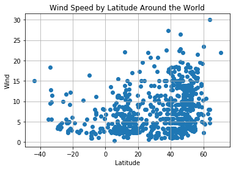

```python
# Dependencies
import json
import requests
import pandas as pd
from config import api_key
import random 
import matplotlib.pyplot as plt
from citipy import citipy
import urllib
```


```python
cities_csv = "worldcities.csv"
cities_df = pd.read_csv(cities_csv)
# cities_df = pd.cities_df1['Latitude']['Longitude']
cities_df.head()
```


<div>
<style scoped>
    .dataframe tbody tr th:only-of-type {
        vertical-align: middle;
    }

    .dataframe tbody tr th {
        vertical-align: top;
    }

    .dataframe thead th {
        text-align: right;
    }
</style>
<table border="1" class="dataframe">
  <thead>
    <tr style="text-align: right;">
      <th></th>
      <th>Country</th>
      <th>City</th>
      <th>Latitude</th>
      <th>Longitude</th>
    </tr>
  </thead>
  <tbody>
    <tr>
      <th>0</th>
      <td>ad</td>
      <td>andorra la vella</td>
      <td>42.500000</td>
      <td>1.516667</td>
    </tr>
    <tr>
      <th>1</th>
      <td>ad</td>
      <td>canillo</td>
      <td>42.566667</td>
      <td>1.600000</td>
    </tr>
    <tr>
      <th>2</th>
      <td>ad</td>
      <td>encamp</td>
      <td>42.533333</td>
      <td>1.583333</td>
    </tr>
    <tr>
      <th>3</th>
      <td>ad</td>
      <td>la massana</td>
      <td>42.550000</td>
      <td>1.516667</td>
    </tr>
    <tr>
      <th>4</th>
      <td>ad</td>
      <td>les escaldes</td>
      <td>42.500000</td>
      <td>1.533333</td>
    </tr>
  </tbody>
</table>
</div>


```python
url = "http://api.openweathermap.org/data/2.5/weather?"
units = "metric"

city_list =[]
lat_random = []
lon_random = []
query_url = []
for i in range(1000):
    lat_random.append(random.choice(cities_df['Latitude']))
    lon_random.append(random.choice(cities_df['Longitude']))
    citiname = citipy.nearest_city(float(lat_random[i]), float(lon_random[i])).city_name
    if citiname not in city_list:
        city_list.append(citiname)

```


```python
len(city_list)
# print(name)
# print(query_url)
```


    797


```python
temp = []
humidity = []
cloud = []
wind = []
lat = []
lon = []
country = []
date = []
maxtemp = []
city_name =[]

for i, city in enumerate(city_list):
    query_url = url +"&appid=" + api_key + "&q=" + urllib.request.pathname2url(city)
#     print(query_url)
    try:
        response = requests.get(query_url).json()
        city_name.append(response['name'])
        temp.append(response['main']['temp'])
        humidity.append(response['main']['humidity'])
        cloud.append(response['clouds']['all'])
        lat.append(response['coord']['lat'])
        lon.append(response['coord']['lon'])
        wind.append(response['wind']['speed'])
        country.append(response['sys']['country'])
        date.append(response['dt'])
        maxtemp.append(response['main']['temp_max'])
    except:
        print(f"{city} Not found")
        pass

```

    umm durman Not found
    guajara-mirim Not found
    kolimvari Not found
    meyungs Not found
    mirina Not found
    sredec Not found
    kalavrita Not found
    dolbeau Not found
    zlatoustovsk Not found
    churumuco Not found
    shcholkine Not found
    karkaralinsk Not found
    raga Not found
    cienaga de flores Not found
    attawapiskat Not found
    duz Not found
    longlac Not found
    gangotri Not found
    chagda Not found
    kleck Not found
    bengkulu Not found
    garbau Not found
    jomalig Not found
    skovde Not found
    juifang Not found
    wulanhaote Not found
    bardiyah Not found
    sorvag Not found
    riyaq Not found
    sukhumi Not found
    bousso Not found
    atsiki Not found
    lushunkou Not found
    ozgon Not found
    tukrah Not found
    tsihombe Not found
    malatya Not found
    ksenyevka Not found
    tubruq Not found
    asayita Not found
    vaitupu Not found
    sentyabrskiy Not found
    vestbygda Not found
    warqla Not found
    kuche Not found
    grand river south east Not found
    straldza Not found
    sikea Not found
    tikheron Not found
    marcona Not found
    irbil Not found
    kimi Not found
    gurskoye Not found
    haibowan Not found
    asfi Not found
    zachagansk Not found
    sakakah Not found
    toliary Not found
    burica Not found
    ayios matthaios Not found
    lyubeshiv Not found
    babanusah Not found
    pagondas Not found
    naftah Not found
    korla Not found
    ngama Not found
    unye Not found
    gulshat Not found
    ndele Not found
    malakal Not found
    perustica Not found
    manzil tamim Not found


```python
len(maxtemp)

```


    725


```python
dictionary = {
    'cities': city_name,
    'country':country,
    'temp': temp,
    'humidity': humidity,
    'cloud': cloud,
    'wind': wind,    
    'max temp': maxtemp,
    'lat': lat,
    'long': lon
}

weather_data = pd.DataFrame(dictionary)
weather_data.to_csv('Weather_Data.csv', sep='\t', encoding='utf-8')
weather_data.head(10)
```


<div>
<style scoped>
    .dataframe tbody tr th:only-of-type {
        vertical-align: middle;
    }

    .dataframe tbody tr th {
        vertical-align: top;
    }

    .dataframe thead th {
        text-align: right;
    }
</style>
<table border="1" class="dataframe">
  <thead>
    <tr style="text-align: right;">
      <th></th>
      <th>cities</th>
      <th>cloud</th>
      <th>country</th>
      <th>humidity</th>
      <th>lat</th>
      <th>long</th>
      <th>max temp</th>
      <th>temp</th>
      <th>wind</th>
    </tr>
  </thead>
  <tbody>
    <tr>
      <th>0</th>
      <td>Ishigaki</td>
      <td>92</td>
      <td>JP</td>
      <td>100</td>
      <td>24.34</td>
      <td>124.16</td>
      <td>295.055</td>
      <td>295.055</td>
      <td>4.10</td>
    </tr>
    <tr>
      <th>1</th>
      <td>Biasca</td>
      <td>0</td>
      <td>CH</td>
      <td>31</td>
      <td>46.36</td>
      <td>8.97</td>
      <td>283.150</td>
      <td>283.150</td>
      <td>1.00</td>
    </tr>
    <tr>
      <th>2</th>
      <td>Kontagora</td>
      <td>0</td>
      <td>NG</td>
      <td>31</td>
      <td>10.40</td>
      <td>5.47</td>
      <td>300.855</td>
      <td>300.855</td>
      <td>3.10</td>
    </tr>
    <tr>
      <th>3</th>
      <td>Urucui</td>
      <td>56</td>
      <td>BR</td>
      <td>70</td>
      <td>-7.23</td>
      <td>-44.56</td>
      <td>301.205</td>
      <td>301.205</td>
      <td>2.55</td>
    </tr>
    <tr>
      <th>4</th>
      <td>Muros</td>
      <td>0</td>
      <td>ES</td>
      <td>62</td>
      <td>42.77</td>
      <td>-9.06</td>
      <td>286.150</td>
      <td>286.150</td>
      <td>6.20</td>
    </tr>
    <tr>
      <th>5</th>
      <td>Horn Lake</td>
      <td>75</td>
      <td>US</td>
      <td>72</td>
      <td>34.96</td>
      <td>-90.03</td>
      <td>292.150</td>
      <td>290.550</td>
      <td>5.10</td>
    </tr>
    <tr>
      <th>6</th>
      <td>Lithakia</td>
      <td>40</td>
      <td>GR</td>
      <td>58</td>
      <td>37.72</td>
      <td>20.83</td>
      <td>287.150</td>
      <td>287.150</td>
      <td>3.10</td>
    </tr>
    <tr>
      <th>7</th>
      <td>Padang</td>
      <td>44</td>
      <td>ID</td>
      <td>100</td>
      <td>-0.92</td>
      <td>100.36</td>
      <td>300.255</td>
      <td>300.255</td>
      <td>3.15</td>
    </tr>
    <tr>
      <th>8</th>
      <td>Faya</td>
      <td>5</td>
      <td>SA</td>
      <td>37</td>
      <td>18.39</td>
      <td>42.45</td>
      <td>292.150</td>
      <td>292.150</td>
      <td>4.60</td>
    </tr>
    <tr>
      <th>9</th>
      <td>Henties Bay</td>
      <td>0</td>
      <td>NA</td>
      <td>96</td>
      <td>-22.12</td>
      <td>14.28</td>
      <td>291.380</td>
      <td>291.380</td>
      <td>2.05</td>
    </tr>
  </tbody>
</table>
</div>


```python
# Create a scatter plot for each data type
plt.scatter(weather_data["lat"],weather_data["max temp"], marker="o")

# Incorporate the other graph properties: title and axis labels
plt.title("Max Temperature by Latitude Around the World")
plt.ylabel("Max Temperature")
plt.xlabel("Latitude")

# Turn on the grid
plt.grid(True)

# Save the figure
plt.savefig('MaxTemp_Lat_Scatter.png', transparent=True, bbox_inches='tight', pad_inches=0)

# Display to screen 
```


```python
# Create a scatter plot for each data type
plt.scatter(weather_data["lat"], weather_data["humidity"], marker="o")

# Incorporate the other graph properties: title and axis labels
plt.title("Humidity by Latitude Around the World")
plt.ylabel("Humidity")
plt.xlabel("Latitude")

# Turn on the grid
plt.grid(True)

# Save the figure
plt.savefig('Humidity_Lat_Scatter.png', transparent=True, bbox_inches='tight', pad_inches=0)


# Display to screen 

```


```python
# Create a scatter plot for each data type
plt.scatter(weather_data["lat"], weather_data["cloud"], marker="o")

# Incorporate the other graph properties: title and axis labels
plt.title("Cloudiness by Latitude Around the World")
plt.ylabel("Cloudiness")
plt.xlabel("Latitude")

# Turn on the grid
plt.grid(True)

# Save the figure
plt.savefig('Cloudiness_Lat_Scatter.png', transparent=True, bbox_inches='tight', pad_inches=0)


# Display to screen 
```


```python
# Create a scatter plot for each data type
wind_lat = plt.scatter(weather_data["lat"], weather_data["wind"],marker="o")

# Incorporate the other graph properties: title and axis labels
plt.title("Wind Speed by Latitude Around the World")
plt.ylabel("Wind")
plt.xlabel("Latitude")

# Turn on the grid
plt.grid(True)

# Save the figure
plt.savefig('WindSpeed_Lat_Scatter.png', transparent=True, bbox_inches='tight', pad_inches=0)

# Display to screen 
```




