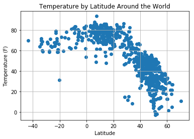
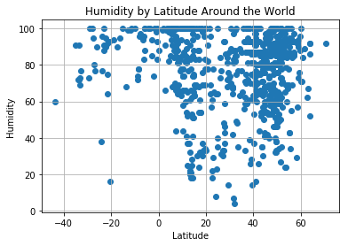

```python
# Dependencies
import json
import requests
import pandas as pd
from config import api_key
import random 
import matplotlib.pyplot as plt
from citipy import citipy
import urllib
```


```python
cities_csv = "worldcities.csv"
cities_df = pd.read_csv(cities_csv)
# cities_df = pd.cities_df1['Latitude']['Longitude']
cities_df.head()
```


<div>
<style scoped>
    .dataframe tbody tr th:only-of-type {
        vertical-align: middle;
    }

    .dataframe tbody tr th {
        vertical-align: top;
    }

    .dataframe thead th {
        text-align: right;
    }
</style>
<table border="1" class="dataframe">
  <thead>
    <tr style="text-align: right;">
      <th></th>
      <th>Country</th>
      <th>City</th>
      <th>Latitude</th>
      <th>Longitude</th>
    </tr>
  </thead>
  <tbody>
    <tr>
      <th>0</th>
      <td>ad</td>
      <td>andorra la vella</td>
      <td>42.500000</td>
      <td>1.516667</td>
    </tr>
    <tr>
      <th>1</th>
      <td>ad</td>
      <td>canillo</td>
      <td>42.566667</td>
      <td>1.600000</td>
    </tr>
    <tr>
      <th>2</th>
      <td>ad</td>
      <td>encamp</td>
      <td>42.533333</td>
      <td>1.583333</td>
    </tr>
    <tr>
      <th>3</th>
      <td>ad</td>
      <td>la massana</td>
      <td>42.550000</td>
      <td>1.516667</td>
    </tr>
    <tr>
      <th>4</th>
      <td>ad</td>
      <td>les escaldes</td>
      <td>42.500000</td>
      <td>1.533333</td>
    </tr>
  </tbody>
</table>
</div>


```python
url = "http://api.openweathermap.org/data/2.5/weather?"
units = "imperial"

city_list =[]
lat_random = []
lon_random = []
query_url = []
for i in range(1000):
    lat_random.append(random.choice(cities_df['Latitude']))
    lon_random.append(random.choice(cities_df['Longitude']))
    citiname = citipy.nearest_city(float(lat_random[i]), float(lon_random[i])).city_name
    if citiname not in city_list:
        city_list.append(citiname)

```


```python
len(city_list)
# print(name)
# print(query_url)
```


    771


```python
temp = []
humidity = []
cloud = []
wind = []
lat = []
lon = []
country = []
date = []
maxtemp = []
city_name =[]


for i, city in enumerate(city_list):
    query_url = url +"&appid=" + api_key + "&units="+ units + "&q=" + urllib.request.pathname2url(city)
#     print(query_url)
    try:
        response = requests.get(query_url).json()
        city_name.append(response['name'])
        temp.append(response['main']['temp'])
        humidity.append(response['main']['humidity'])
        cloud.append(response['clouds']['all'])
        lat.append(response['coord']['lat'])
        lon.append(response['coord']['lon'])
        wind.append(response['wind']['speed'])
        country.append(response['sys']['country'])
        date.append(response['dt'])
        maxtemp.append(response['main']['temp_max'])
        print(f"Processing Record for {city}")
    except:
        print(f"{city} Not found")
        pass


```

    Processing Record for beira
    Processing Record for bereslavka
    Processing Record for adre
    Processing Record for alghero
    wulanhaote Not found
    Processing Record for sabha
    Processing Record for dzerzhinsk
    vrina Not found
    Processing Record for edd
    Processing Record for palkonda
    Processing Record for great yarmouth
    maarianhamina Not found
    Processing Record for biltine
    Processing Record for shache
    Processing Record for guasdualito
    Processing Record for cabo san lucas
    Processing Record for mosbach
    Processing Record for cortes
    Processing Record for ajaccio
    Processing Record for peremyshlyany
    Processing Record for pedernales
    juifang Not found
    Processing Record for san jose
    Processing Record for torbay
    Processing Record for felanitx
    ketchenery Not found
    Processing Record for lixourion
    Processing Record for javornik
    Processing Record for bereda
    Processing Record for marabba
    Processing Record for quedlinburg
    Processing Record for itarema
    Processing Record for brunehaut
    Processing Record for traverse city
    ilka Not found
    Processing Record for kloulklubed
    Processing Record for athabasca
    Processing Record for sami
    Processing Record for wendo
    Processing Record for zarichne
    Processing Record for salem
    Processing Record for adrar
    Processing Record for jutiquile
    Processing Record for balasheyka
    Processing Record for dolhesti
    Processing Record for thunder bay
    haibowan Not found
    Processing Record for jiexiu
    Processing Record for kahramanmaras
    Processing Record for piscu vechi
    Processing Record for baghdad
    Processing Record for jiuquan
    Processing Record for san pedro de uraba
    Processing Record for fukue
    nyzhnya krynka Not found
    Processing Record for nikolskoye
    Processing Record for hami
    Processing Record for kaseda
    Processing Record for san patricio
    Processing Record for suluq
    Processing Record for jamestown
    Processing Record for la rioja
    Processing Record for besancon
    Processing Record for san angelo
    Processing Record for oum hadjer
    Processing Record for krylovskaya
    Processing Record for svetlaya
    Processing Record for kamien pomorski
    hoparta Not found
    Processing Record for hermagor
    Processing Record for esperance
    Processing Record for brezno
    Processing Record for ivanava
    Processing Record for tynda
    Processing Record for esenyurt
    Processing Record for gat
    Processing Record for akcaabat
    Processing Record for broome
    Processing Record for lyuban
    Processing Record for kuryk
    Processing Record for sorso
    Processing Record for mwinilunga
    Processing Record for olkhovka
    Processing Record for kilis
    Processing Record for faya
    Processing Record for dicabisagan
    Processing Record for san pedro
    Processing Record for pirmasens
    Processing Record for san esteban
    Processing Record for denizli
    Processing Record for den helder
    Processing Record for nea mesimvria
    Processing Record for kalawit
    Processing Record for nikolayevka
    Processing Record for clonakilty
    malwan Not found
    Processing Record for zamosc
    Processing Record for otukpo
    Processing Record for weirton
    Processing Record for kutum
    Processing Record for luderitz
    Processing Record for owak
    Processing Record for vilani
    Processing Record for skibbereen
    Processing Record for ribeira grande
    Processing Record for spasskoye
    Processing Record for dubno
    Processing Record for filadelfia
    sakakah Not found
    Processing Record for marinette
    Processing Record for kameshkovo
    Processing Record for barbastro
    karkaralinsk Not found
    Processing Record for havelock
    Processing Record for mitha tiwana
    Processing Record for kapaa
    Processing Record for novotroitskaya
    saint-honore Not found
    Processing Record for shetpe
    Processing Record for puerto ayora
    Processing Record for kathu
    Processing Record for kapuskasing
    Processing Record for ocos
    Processing Record for chapais
    Processing Record for taoudenni
    Processing Record for hauterive
    marcona Not found
    Processing Record for mitsamiouli
    Processing Record for odate
    Processing Record for bolshaya dzhalga
    Processing Record for sandominic
    Processing Record for redmond
    Processing Record for cockburn town
    Processing Record for kargasok
    Processing Record for kalmunai
    safaga Not found
    Processing Record for kongoussi
    karamay Not found
    Processing Record for henties bay
    Processing Record for petrovac
    Processing Record for gorele
    Processing Record for sorumsand
    Processing Record for buta
    Processing Record for koppal
    Processing Record for kotturu
    Processing Record for dalhousie
    Processing Record for mariel
    Processing Record for bjelovar
    Processing Record for bilma
    Processing Record for sidlaghatta
    Processing Record for kluczbork
    Processing Record for saldanha
    Processing Record for tual
    Processing Record for butaritari
    attawapiskat Not found
    Processing Record for kurchum
    Processing Record for sarahan
    Processing Record for arlit
    Processing Record for matagami
    Processing Record for jaca
    Processing Record for kaniama
    Processing Record for dryden
    Processing Record for atuona
    Processing Record for appleton
    Processing Record for saint george
    Processing Record for misratah
    gazion Not found
    Processing Record for beausejour
    Processing Record for oranjestad
    Processing Record for bourges
    Processing Record for saint anthony
    Processing Record for dubuque
    Processing Record for pervoye maya
    Processing Record for wagar
    Processing Record for iqaluit
    Processing Record for jalna
    Processing Record for bad salzungen
    Processing Record for ilebo
    Processing Record for peniche
    Processing Record for tashla
    zachagansk Not found
    Processing Record for beihai
    Processing Record for ekibastuz
    Processing Record for natitingou
    Processing Record for ust-kulom
    Processing Record for aromashevo
    Processing Record for vanavara
    Processing Record for costinesti
    Processing Record for vilyuysk
    Processing Record for koulikoro
    Processing Record for la ronge
    Processing Record for airai
    Processing Record for schruns
    Processing Record for erzin
    Processing Record for luklukan
    Processing Record for manaure
    Processing Record for constantine
    Processing Record for kankakee
    Processing Record for georgetown
    Processing Record for brigantine
    Processing Record for mahon
    Processing Record for seybaplaya
    Processing Record for jever
    Processing Record for malartic
    Processing Record for fuldatal
    Processing Record for altay
    Processing Record for rantepao
    Processing Record for cabadiangan
    sapai Not found
    Processing Record for neverkino
    bokspits Not found
    Processing Record for sorab
    Processing Record for siniscola
    Processing Record for tire
    Processing Record for meulaboh
    Processing Record for wanning
    Processing Record for siocon
    Processing Record for aquin
    Processing Record for lyubuchany
    Processing Record for tuttlingen
    bari Not found
    Processing Record for guantanamo
    Processing Record for erenhot
    Processing Record for buluang
    Processing Record for hithadhoo
    Processing Record for zuhres
    Processing Record for drexel heights
    Processing Record for whitley bay
    Processing Record for camindangan
    Processing Record for bestobe
    Processing Record for virginia beach
    Processing Record for shubarshi
    Processing Record for altoona
    Processing Record for galle
    Processing Record for iralaya
    Processing Record for bethlehem
    Processing Record for fayetteville
    Processing Record for kuznetsk
    Processing Record for okrika
    Processing Record for umm kaddadah
    Processing Record for nantucket
    tlahualilo Not found
    Processing Record for joshimath
    Processing Record for kindersley
    Processing Record for columbia
    bac lieu Not found
    Processing Record for kamenka
    Processing Record for bastia
    Processing Record for ivybridge
    Processing Record for apostolove
    Processing Record for agueda
    Processing Record for halifax
    Processing Record for indianola
    taolanaro Not found
    Processing Record for gouvy
    Processing Record for cobadin
    Processing Record for khani
    Processing Record for valley city
    Processing Record for alihe
    wazzan Not found
    Processing Record for naze
    Processing Record for agboville
    Processing Record for soyo
    Processing Record for magistralnyy
    Processing Record for nellikkuppam
    Processing Record for sarmizegetusa
    bengkulu Not found
    Processing Record for nanortalik
    Processing Record for lubbenau
    Processing Record for haradok
    Processing Record for moose factory
    Processing Record for terrace bay
    Processing Record for fengcheng
    Processing Record for marquette
    Processing Record for kandava
    Processing Record for espanola
    Processing Record for wajima
    Processing Record for burla
    Processing Record for talbahat
    Processing Record for balkhash
    Processing Record for huntington
    Processing Record for buraydah
    Processing Record for almaty
    Processing Record for zaltan
    Processing Record for zlobin
    Processing Record for auki
    Processing Record for tansen
    Processing Record for fatehpur sikri
    Processing Record for englewood
    Processing Record for banikoara
    Processing Record for ordzhonikidze
    Processing Record for pignon
    Processing Record for kachug
    Processing Record for bueu
    Processing Record for agadez
    Processing Record for nowogard
    Processing Record for morant bay
    Processing Record for rincon
    Processing Record for tervel
    Processing Record for dhampur
    Processing Record for lesnoy
    Processing Record for sistranda
    Processing Record for ashta
    Processing Record for balabac
    Processing Record for carpentras
    Processing Record for veraval
    Processing Record for zarautz
    Processing Record for ugoofaaru
    Processing Record for san rafael del sur
    Processing Record for kolpny
    Processing Record for weston
    Processing Record for abeokuta
    Processing Record for tsabong
    Processing Record for marawi
    Processing Record for hovd
    sentyabrskiy Not found
    Processing Record for hollister
    ye Not found
    odweyne Not found
    Processing Record for calabaca
    Processing Record for vendome
    Processing Record for canakkale
    Processing Record for wukari
    Processing Record for soe
    iskele Not found
    qui nhon Not found
    Processing Record for lomza
    bargal Not found
    Processing Record for paoua
    Processing Record for gurgentepe
    Processing Record for dori
    Processing Record for albenga
    Processing Record for haverfordwest
    Processing Record for ponta do sol
    berbera Not found
    Processing Record for dera ghazi khan
    Processing Record for shelopugino
    Processing Record for carman
    Processing Record for kummersbruck
    Processing Record for merrill
    Processing Record for ishigaki
    Processing Record for bata
    saryshagan Not found
    Processing Record for dzierzoniow
    Processing Record for sarangani
    Processing Record for clearlake
    Processing Record for asosa
    Processing Record for mercedes
    Processing Record for pula
    Processing Record for karaton
    Processing Record for chiang kham
    Processing Record for baker city
    kot putli Not found
    Processing Record for codrington
    Processing Record for junction city
    Processing Record for chaumont
    Processing Record for cotnari
    Processing Record for marzuq
    Processing Record for beyneu
    Processing Record for klyuchi
    Processing Record for banes
    Processing Record for zemio
    Processing Record for cayhagan
    Processing Record for krosno
    Processing Record for ikon-khalk
    Processing Record for borgentreich
    Processing Record for elhovo
    Processing Record for alexandroupoli
    Processing Record for hambantota
    Processing Record for ginir
    Processing Record for syedove
    kuche Not found
    Processing Record for orsha
    dzhusaly Not found
    Processing Record for domat
    Processing Record for carovigno
    Processing Record for capreol
    Processing Record for san quintin
    Processing Record for rikitea
    Processing Record for savannah bight
    Processing Record for mamallapuram
    Processing Record for laguna
    Processing Record for waddan
    Processing Record for pisco
    Processing Record for mugur-aksy
    Processing Record for awjilah
    Processing Record for priiskovyy
    Processing Record for sestu
    ndele Not found
    Processing Record for nynashamn
    Processing Record for salihorsk
    Processing Record for calatele
    Processing Record for ludwigslust
    dalneye konstantinovo Not found
    Processing Record for kralendijk
    Processing Record for garmisch-partenkirchen
    Processing Record for ati
    Processing Record for chazuta
    Processing Record for meaford
    Processing Record for latung
    Processing Record for katubao
    Processing Record for chara
    Processing Record for havre-saint-pierre
    tsihombe Not found
    Processing Record for busselton
    Processing Record for yatou
    Processing Record for douglas
    Processing Record for phalaborwa
    Processing Record for sinnamary
    Processing Record for lodja
    Processing Record for thompson
    Processing Record for ierapetra
    Processing Record for mutoko
    Processing Record for chany
    Processing Record for beruwala
    Processing Record for seydi
    Processing Record for altamont
    Processing Record for bitkine
    Processing Record for warrington
    Processing Record for nadezhda
    Processing Record for pandan
    Processing Record for weihai
    Processing Record for wattegama
    Processing Record for santo domingo suchitepequez
    Processing Record for at-bashi
    Processing Record for siderno
    Processing Record for ushtobe
    Processing Record for snyder
    Processing Record for lefka
    Processing Record for kysucke nove mesto
    thermon Not found
    Processing Record for narovchat
    Processing Record for acapulco
    Processing Record for moussoro
    Processing Record for vezirkopru
    Processing Record for tuyen quang
    Processing Record for moa
    Processing Record for santa marta de tormes
    Processing Record for tessalit
    Processing Record for muros
    Processing Record for harnosand
    waw Not found
    Processing Record for pochutla
    Processing Record for saratovskaya
    Processing Record for kalemie
    Processing Record for kruibeke
    Processing Record for kungurtug
    Processing Record for ginda
    Processing Record for aranos
    Processing Record for birao
    Processing Record for lienz
    Processing Record for san vicente
    Processing Record for penzance
    kedrovka Not found
    Processing Record for kholuy
    Processing Record for high level
    Processing Record for palaiokomi
    Processing Record for yelan
    Processing Record for rankovce
    Processing Record for les cayes
    Processing Record for vigia del fuerte
    Processing Record for okhotsk
    Processing Record for kerrville
    Processing Record for navahrudak
    Processing Record for omaruru
    Processing Record for guerrero negro
    Processing Record for moustheni
    Processing Record for garbsen
    Processing Record for ayagoz
    kollumerland Not found
    Processing Record for burlatskoye
    Processing Record for bellefontaine
    Processing Record for saint-tite
    Processing Record for cefalu
    Processing Record for namibe
    Processing Record for mlyniv
    Processing Record for santander
    Processing Record for duku
    Processing Record for kathmandu
    Processing Record for hilo
    Processing Record for xifeng
    Processing Record for peru
    Processing Record for riyadh
    Processing Record for veshenskaya
    Processing Record for mykhaylivka
    Processing Record for magdagachi
    Processing Record for kavaratti
    Processing Record for simao
    Processing Record for merke
    Processing Record for talisay
    Processing Record for bermeo
    Processing Record for konin
    Processing Record for bonavista
    Processing Record for jizan
    Processing Record for dingle
    Processing Record for mandalgovi
    Processing Record for reims
    Processing Record for bagepalli
    Processing Record for kevsala
    Processing Record for katete
    kilakarai Not found
    Processing Record for gelnica
    Processing Record for minot
    bardiyah Not found
    Processing Record for lloret de mar
    Processing Record for abay
    Processing Record for wajid
    Processing Record for kerouane
    Processing Record for christchurch
    Processing Record for bourbonnais
    Processing Record for salalah
    Processing Record for awbari
    Processing Record for kidal
    zolotinka Not found
    Processing Record for hvide sande
    Processing Record for grenaa
    Processing Record for lanivtsi
    Processing Record for ojinaga
    Processing Record for omboue
    Processing Record for yining
    Processing Record for laredo
    Processing Record for riviere-du-loup
    Processing Record for dongtai
    tubruq Not found
    Processing Record for jalu
    Processing Record for mao
    Processing Record for dubrovnik
    Processing Record for lubao
    Processing Record for klobuck
    Processing Record for krasnyy kut
    astipalaia Not found
    panjwin Not found
    Processing Record for ferme-neuve
    Processing Record for kotovo
    Processing Record for odolena voda
    Processing Record for moissala
    Processing Record for saint-raymond
    Processing Record for sao filipe
    Processing Record for kurumkan
    Processing Record for likhoy
    Processing Record for geneva
    Processing Record for aliaga
    Processing Record for ghanzi
    Processing Record for verkh-suetka
    Processing Record for bongandanga
    Processing Record for ouadda
    Processing Record for kamskiye polyany
    Processing Record for gyulahaza
    Processing Record for constitucion
    Processing Record for zary
    Processing Record for la sarre
    Processing Record for camabatela
    Processing Record for starkville
    Processing Record for rockland
    Processing Record for tignere
    Processing Record for flin flon
    Processing Record for viisoara
    aflu Not found
    Processing Record for murray bridge
    Processing Record for torquay
    Processing Record for kosh-agach
    Processing Record for gao
    Processing Record for beterou
    Processing Record for bondoukou
    Processing Record for bhuvanagiri
    Processing Record for rheda-wiedenbruck
    Processing Record for komnina
    Processing Record for ayan
    Processing Record for wielun
    Processing Record for yurovka
    Processing Record for lagos
    Processing Record for damietta
    Processing Record for kenora
    Processing Record for narragansett
    Processing Record for sandpoint
    Processing Record for el paso
    Processing Record for matei
    Processing Record for roblin
    Processing Record for hoopstad
    Processing Record for ozerna
    Processing Record for assen
    Processing Record for antofagasta
    Processing Record for lelesti
    Processing Record for quaregnon
    Processing Record for boguchar
    Processing Record for tongliao
    Processing Record for nenjiang
    Processing Record for forst
    Processing Record for salinas
    Processing Record for tabou
    Processing Record for lai
    Processing Record for liliongan
    Processing Record for sioux lookout
    Processing Record for bridlington
    Processing Record for oussouye
    Processing Record for novi di modena
    Processing Record for umm lajj
    Processing Record for lucea
    Processing Record for bad goisern
    Processing Record for tumalaytay
    Processing Record for la baule-escoublac
    Processing Record for bad wildbad
    Processing Record for seoul
    Processing Record for staunton
    ningan Not found
    Processing Record for intipuca
    Processing Record for uyuni
    Processing Record for troitskoye
    Processing Record for bathsheba
    Processing Record for canmore
    Processing Record for sukhobezvodnoye
    Processing Record for kampot
    Processing Record for shenjiamen
    Processing Record for niquero
    Processing Record for claremont
    Processing Record for bassano
    port-de-paix Not found
    Processing Record for znamenskoye
    Processing Record for humboldt
    Processing Record for zaysan
    Processing Record for manuk mangkaw
    Processing Record for warsaw
    Processing Record for dangtu
    Processing Record for hearst
    Processing Record for ornskoldsvik
    Processing Record for hit
    Processing Record for movilita
    Processing Record for dobresti
    Processing Record for burgos
    Processing Record for orange walk
    Processing Record for boa vista
    Processing Record for hayrabolu
    Processing Record for puerto quijarro
    Processing Record for geraldton
    Processing Record for nikolayevskaya
    Processing Record for west plains
    Processing Record for halmstad
    Processing Record for cogoleto
    asayita Not found
    Processing Record for clyde river
    Processing Record for basco
    Processing Record for jicin
    Processing Record for reidsville
    Processing Record for najran
    Processing Record for great bend
    Processing Record for jega
    Processing Record for bisira
    Processing Record for bakchar
    Processing Record for mudigere
    Processing Record for lykhivka
    katsiveli Not found
    Processing Record for harlingen
    Processing Record for acari
    Processing Record for guryevsk
    mouzakion Not found
    Processing Record for voroshnevo
    bury saint edmunds Not found
    Processing Record for tim
    Processing Record for abyek
    Processing Record for ogaminana
    Processing Record for verguleasa
    Processing Record for sarankhola
    Processing Record for montesilvano
    Processing Record for xining
    Processing Record for atkarsk
    wahran Not found
    Processing Record for beipiao
    Processing Record for abu samrah
    raga Not found
    Processing Record for hirara
    Processing Record for pryozerne
    Processing Record for mizdah
    ferai Not found
    Processing Record for luanda
    Processing Record for sokoni
    Processing Record for barvinkove
    Processing Record for kyzyl-suu
    Processing Record for kara-tyube
    Processing Record for boda
    Processing Record for douentza
    Processing Record for langsa
    Processing Record for glasgow
    Processing Record for maine-soroa
    Processing Record for aviles
    Processing Record for korce
    Processing Record for kon tum
    gomel Not found
    Processing Record for dolovo
    Processing Record for san cristobal
    Processing Record for savannakhet
    Processing Record for amambai
    Processing Record for letlhakane
    Processing Record for leh
    Processing Record for canazas
    Processing Record for lahad datu
    Processing Record for valparaiso
    Processing Record for arraial do cabo
    Processing Record for lang son
    Processing Record for brunico
    burica Not found
    Processing Record for xichang
    Processing Record for tarcau
    Processing Record for ghansor
    acarau Not found
    Processing Record for cape town
    Processing Record for puerto wilches
    Processing Record for gravelbourg
    Processing Record for imamoglu
    Processing Record for cam ranh
    Processing Record for taldan
    Processing Record for qinhuangdao
    Processing Record for hamilton
    Processing Record for xiaoshi
    Processing Record for wahpeton
    Processing Record for yakeshi
    Processing Record for tonekabon
    Processing Record for toropets
    Processing Record for xuanhua
    Processing Record for atbasar
    Processing Record for kromy
    Processing Record for darhan
    Processing Record for sringeri
    sinkat Not found
    Processing Record for muskogee
    Processing Record for varhaug
    Processing Record for gamba
    bocaranga Not found
    Processing Record for naigarhi
    Processing Record for zhaozhou
    Processing Record for megion
    hurghada Not found
    Processing Record for nouadhibou
    grand river south east Not found
    Processing Record for mkokotoni
    Processing Record for orissaare
    barbar Not found
    Processing Record for saint-felicien
    Processing Record for sterling
    Processing Record for vavoua
    Processing Record for darnah
    Processing Record for giddalur
    Processing Record for mitchellville
    Processing Record for coria
    Processing Record for aku
    gurgan Not found
    Processing Record for tahoua
    Processing Record for tolcsva
    balykshi Not found
    Processing Record for vila
    Processing Record for alcala de henares
    Processing Record for bossangoa
    Processing Record for marathon
    Processing Record for biala podlaska
    Processing Record for gubkin
    Processing Record for acajutla
    Processing Record for scarborough
    Processing Record for adra
    Processing Record for sankt margrethen
    Processing Record for kontagora
    Processing Record for portobelo
    Processing Record for vieste
    Processing Record for ruteng
    Processing Record for nedumangad
    Processing Record for malkara
    Processing Record for iztapa
    Processing Record for la victoria
    Processing Record for heidelberg
    disna Not found
    Processing Record for winnemucca
    Processing Record for canton
    Processing Record for kologriv


```python
len(maxtemp)

```


    699


```python
dictionary = {
    'cities': city_name,
    'country':country,
    'temp': temp,
    'humidity': humidity,
    'cloud': cloud,
    'wind': wind,    
    'max temp': maxtemp,
    'lat': lat,
    'long': lon
}

weather_data = pd.DataFrame(dictionary)
weather_data.head(10)
```


<div>
<style scoped>
    .dataframe tbody tr th:only-of-type {
        vertical-align: middle;
    }

    .dataframe tbody tr th {
        vertical-align: top;
    }

    .dataframe thead th {
        text-align: right;
    }
</style>
<table border="1" class="dataframe">
  <thead>
    <tr style="text-align: right;">
      <th></th>
      <th>cities</th>
      <th>cloud</th>
      <th>country</th>
      <th>humidity</th>
      <th>lat</th>
      <th>long</th>
      <th>max temp</th>
      <th>temp</th>
      <th>wind</th>
    </tr>
  </thead>
  <tbody>
    <tr>
      <th>0</th>
      <td>Beira</td>
      <td>0</td>
      <td>ES</td>
      <td>81</td>
      <td>43.20</td>
      <td>-8.36</td>
      <td>51.80</td>
      <td>49.89</td>
      <td>8.05</td>
    </tr>
    <tr>
      <th>1</th>
      <td>Bereslavka</td>
      <td>48</td>
      <td>UA</td>
      <td>86</td>
      <td>47.89</td>
      <td>32.29</td>
      <td>35.96</td>
      <td>35.96</td>
      <td>10.54</td>
    </tr>
    <tr>
      <th>2</th>
      <td>Adre</td>
      <td>0</td>
      <td>TD</td>
      <td>20</td>
      <td>13.47</td>
      <td>22.20</td>
      <td>67.28</td>
      <td>67.28</td>
      <td>11.21</td>
    </tr>
    <tr>
      <th>3</th>
      <td>Alghero</td>
      <td>0</td>
      <td>IT</td>
      <td>76</td>
      <td>40.56</td>
      <td>8.32</td>
      <td>53.60</td>
      <td>53.60</td>
      <td>6.93</td>
    </tr>
    <tr>
      <th>4</th>
      <td>Sabha</td>
      <td>0</td>
      <td>LY</td>
      <td>30</td>
      <td>27.03</td>
      <td>14.43</td>
      <td>66.20</td>
      <td>66.20</td>
      <td>11.21</td>
    </tr>
    <tr>
      <th>5</th>
      <td>Dzerzhinsk</td>
      <td>40</td>
      <td>RU</td>
      <td>69</td>
      <td>56.24</td>
      <td>43.46</td>
      <td>37.40</td>
      <td>37.40</td>
      <td>13.42</td>
    </tr>
    <tr>
      <th>6</th>
      <td>Edd</td>
      <td>0</td>
      <td>ER</td>
      <td>53</td>
      <td>13.93</td>
      <td>41.69</td>
      <td>69.26</td>
      <td>69.26</td>
      <td>2.71</td>
    </tr>
    <tr>
      <th>7</th>
      <td>Palkonda</td>
      <td>0</td>
      <td>IN</td>
      <td>98</td>
      <td>18.60</td>
      <td>83.76</td>
      <td>68.22</td>
      <td>68.22</td>
      <td>3.71</td>
    </tr>
    <tr>
      <th>8</th>
      <td>Great Yarmouth</td>
      <td>88</td>
      <td>GB</td>
      <td>93</td>
      <td>52.61</td>
      <td>1.73</td>
      <td>48.20</td>
      <td>48.20</td>
      <td>11.41</td>
    </tr>
    <tr>
      <th>9</th>
      <td>Biltine</td>
      <td>0</td>
      <td>TD</td>
      <td>18</td>
      <td>14.53</td>
      <td>20.93</td>
      <td>68.81</td>
      <td>68.81</td>
      <td>11.77</td>
    </tr>
  </tbody>
</table>
</div>


```python
# Create a scatter plot for each data type
plt.scatter(weather_data["lat"],weather_data["temp"], marker="o")

# Incorporate the other graph properties: title and axis labels
plt.title("Temperature by Latitude Around the World")
plt.ylabel("Temperature (F)")
plt.xlabel("Latitude")

# Turn on the grid
plt.grid(True)

# Save the figure


# Display to screen 
```





```python
# Create a scatter plot for each data type
plt.scatter(weather_data["lat"], weather_data["humidity"], marker="o")

# Incorporate the other graph properties: title and axis labels
plt.title("Humidity by Latitude Around the World")
plt.ylabel("Humidity")
plt.xlabel("Latitude")

# Turn on the grid
plt.grid(True)

# Save the figure


# Display to screen 

```





```python
# Create a scatter plot for each data type
plt.scatter(weather_data["lat"], weather_data["cloud"], marker="o")

# Incorporate the other graph properties: title and axis labels
plt.title("Cloudiness by Latitude Around the World")
plt.ylabel("Cloudiness")
plt.xlabel("Latitude")

# Turn on the grid
plt.grid(True)

# Save the figure


# Display to screen 
```


```python
# Create a scatter plot for each data type
wind_lat = plt.scatter(weather_data["lat"], weather_data["wind"],marker="o")

# Incorporate the other graph properties: title and axis labels
plt.title("Wind Speed by Latitude Around the World")
plt.ylabel("Wind")
plt.xlabel("Latitude")

# Turn on the grid
plt.grid(True)

# Save the figure
plt.savefig("wind_lat.png", format="png")

# Display to screen 
```


